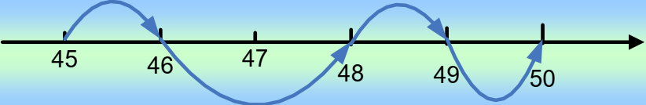
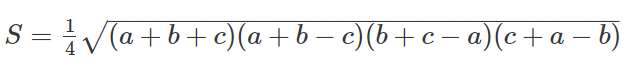

# ĐỀ Tin học cơ sở 2 PTIT (Đề C CodePTIT)

## KIỂU DỮ LIỆU VÀ PHÉP TOÁN

### C01001 - GẤP ĐÔI

Cho số tự nhiên N không quá 7 chữ số. Hãy in ra giá trị gấp đôi của N.

**Input**

Có duy nhất một số tự nhiên không quá 7 chữ số.

**Output**

Ghi ra kết quả trên một dòng.

**Ví dụ**

 | **Input** | **Output** |
|---|---|
| 23 | 46 |

### C01002 - GẤP ĐÔI 2

Cho số tự nhiên N không quá 9 chữ số. Hãy in ra giá trị gấp đôi của N.

**Input**

Dòng đầu ghi số bộ test. Mỗi bộ test có duy nhất một số tự nhiên không quá 9 chữ số.

**Output**

Với mỗi bộ test, ghi ra kết quả trên một dòng.

**Ví dụ**

 | **Input** | **Output** |
|---|---|
| 2  1  23 | 2  46 |

### C01003 - BÌNH PHƯƠNG

Cho số tự nhiên N không quá 9 chữ số. Hãy in ra giá trị bình phương của N.

**Input**

Dòng đầu ghi số bộ test. Mỗi bộ test có duy nhất một số tự nhiên không quá 9 chữ số.

**Output**

Với mỗi bộ test, ghi ra kết quả trên một dòng.

**Ví dụ**

 | **Input** | **Output** |
|---|---|
| 2  1  23 | 1  529 |

### C01004 - GIÁ TRỊ THẬP PHÂN

Cho số nguyên dương N không quá 9 chữ số. Hãy in ra giá trị thập phân 1/N.

**Input**

Dòng đầu ghi số bộ test. Mỗi bộ test có duy nhất một số nguyên dương không quá 9 chữ số.

**Output**

Với mỗi bộ test, ghi ra kết quả trên một dòng với đúng 15 số sau dấu phẩy.

**Ví dụ**

 | **Input** | **Output** |
|---|---|
| 2  1  23 | 1.000000000000000  0.043478260869565 |

### C01005 - TÍNH TỔNG

Cho hai số nguyên (có thể âm) có giá trị tuyệt đối không quá 106.

Viết chương trình tính tổng hai số

**Input**

Có duy nhất một dòng ghi hai số nguyên, cách nhau một khoảng trống.

**Output**

In kết quả trên một dòng

**Ví dụ**

 | **Input** | **Output** |
|---|---|
| 10 2 | 12 |

### C01006 - PHÉP TOÁN CƠ BẢN 1

Nhập 2 số nguyên dương a,b không quá 1000.

Hãy in ra lần lượt các giá trị: tổng, hiệu, tích, chia kết quả thực (với đúng 2 chữ số sau dấu phẩy) và chia phần dư của 2 số a,b đã cho.

Kết quả tính toán ghi trên một dòng. Nếu b = 0 thì không thực hiện phép toán nào mà chỉ in ra số 0.

**Input**

Chỉ có 2 số a,b trên một dòng.

**Output**

Ghi ra lần lượt kết quả các phép toán trên một dòng.

**Ví dụ**

 | **Input** | **Output** |
|---|---|
| 10 5 | 15 5 50 2.00 0 |

### C01007 - PHÉP TOÁN CƠ BẢN 2

Nhập 2 số nguyên dương a,b không quá 6 chữ số.

Hãy in ra lần lượt các giá trị: tổng, hiệu, tích, chia phần nguyên, chia phần dư, chia kết quả thực (với đúng 2 chữ số sau dấu phẩy) của 2 số a,b đã cho.

Mỗi kết quả tính toán ghi trên một dòng

**Input**

Chỉ có 2 số a,b trên một dòng.

**Output**

Gồm 6 dòng lần lượt là kết quả của các phép tính theo thứ tự trong mô tả đề bài.

**Ví dụ**

 | **Input** | **Output** |
|---|---|
| 1 2 | 3  -1  2  0  1  0.50 |

### C01009 - CHUYỂN ĐỔI THANG ĐO NHIỆT ĐỘ

Công thức chuyển đơn vị đo nhiệt độ từ C sang F như sau:

F = (C \* 9 / 5) + 32

Viết chương trình nhập vào nhiệt độ đo theo độ C, thực hiện chuyển sang đơn vị đo độ F và in ra màn hình. (Lưu ý luôn lấy 2 chữ số thập phân).

**Input**

Có duy nhất một dòng ghi nhiệt độ đo theo độ C (không quá 100).

**Output**

In kết quả trên một dòng.

**Ví dụ**

 | **Input** | **Output** |
|---|---|
| 24 | 75.20 |

### C01010 - CHUYỂN ĐỔI NGÀY THÁNG

Viết chương trình nhập vào số ngày, thực hiện chuyển số ngày sang năm, tuần, ngày (bỏ qua trường hợp năm nhuận).

**Input**

Có duy nhất một dòng ghi số ngảy, không quá 1000.

**Output**

In kết quả trên một dòng theo thứ tự: năm – tuần – ngày, mỗi số cách nhau một khoảng trống.

**Ví dụ**

 | **Input** | **Output** |
|---|---|
| 350 | 0 50 0 |

### C01014 - PHƯƠNG TRÌNH BẬC NHẤT

Viết chương trình nhập 2 số thực a,b và in ra nghiệm của phương trình bậc nhất a\*x+b=0.

**Input**

Chỉ có một dòng ghi hai số a,b.

**Output**

Kết quả ghi ra trên một dòng tương ứng là “Vo nghiem” “Vo so nghiem” hoặc nghiệm dưới dạng số thực có đúng 2 chữ số sau dấu phẩy.

**Ví dụ**

 | **Input** | **Output** |
|---|---|
| 2 -1 | 0.50 |
| 0 1 | Vo nghiem |
| 0 0 | Vo so nghiem |

### C01015 - PHƯƠNG TRÌNH BẬC HAI

Viết chương trình nhập 3 số thực a,b,c và in ra nghiệm của phương trình bậc hai a\*x2 + b\*x + c = 0.

**Input**

Chỉ có một dòng ghi ba số a,b,c, giá trị tuyệt đối không quá 1000. Không có trường hợp a = b = c = 0.

**Output**

Kết quả ghi ra trên một dòng, nếu không có nghiệm in ra NO.

**Ví dụ**

 | **Input** | **Output** |
|---|---|
| 1 2 1 | -1.00 |

### C01018 - SỐ CHÍNH PHƯƠNG

Nhập một số nguyên dương không quá 9 chữ số. Hãy kiểm tra xem đó có phải số chính phương hay không.

**Input**

Dòng đầu của dữ liệu vào ghi số bộ test, mỗi bộ test ghi một số nguyên dương N.

**Output**

Ghi ra YES nếu đúng và NO nếu không.

**Ví dụ**

 | **Input** | **Output** |
|---|---|
| 3  11  121  361 | NO  YES  YES |

### C01025 - HÌNH VUÔNG NHỎ NHẤT

Cho 2 hình chữ nhật trên mặt phẳng Oxy. Cần tìm hình vuông có kích thước nhỏ nhất sao cho phủ kín được 2 hình chữ nhật đã cho.

**Dữ liệu vào:**

2 dòng, mỗi dòng gồm 4 số nguyên lần lượt mô tả điểm trái dưới và phải trên của hình chữ nhật. Các tọa độ có giá trị tuyệt đối không vượt quá 100.

**Kết quả:**

In ra diện tích của hình vuông tìm được.

**Ví dụ:**

 | **Input** | **Output** |
|---|---|
| 6 6 8 8  1 8 4 9 | 49 |

### C01066 - GIÁ TRỊ NHỎ NHẤT TRONG BA SỐ

Viết chương trình nhập vào ba số nguyên có trị tuyệt đối không quá 6 chữ số. Tìm giá trị nhỏ nhất trong ba số đó.

**Input**

Chỉ có một dòng ghi ba số a,b,c cách nhau một khoảng trống. Cả ba số không quá 6 chữ số.

**Output**

Ghi ra số nhỏ nhất.

**Ví dụ**

 | **Input** | **Output** |
|---|---|
| 10 20 30 | 10 |

### C01070 - GHÉP HÌNH

Cho ba hình chữ nhật. Các bạn được phép xoay hình nhưng không được phép xếp chồng lấn lên nhau, hỏi 3 hình chữ nhật đó có thể ghép thành một hình vuông được hay không

**Input:** Có ba dòng, mỗi dòng ghi hai số nguyên dương là chiều rộng và chiều cao của hình chữ nhật (các số đều không quá 100).

**Output:** Ghi ra YES nếu có thể tạo thành hình vuông, NO nếu không thể.

**Ví dụ:**

 | **Input** | **Output** |
|---|---|
| 8 2  1 6  7 6 | YES |

### C03041 - HÌNH VUÔNG

Cho 2 đỉnh là góc dưới bên trái và góc trên bên phải của hình chữ nhật trong hệ tọa độ Oxy. Hãy kiểm tra xem đó có phải là hình vuông hay không.

**Input**

Dòng đầu ghi số bộ test

Mỗi test có 4 số nguyên a,b,c,d.

Trong đó (a,b) là tọa độ điểm góc dưới bên trái, (c,d) là tọa độ góc trên bên phải (-1000 &lt;a&lt;c&lt;1000; -1000&lt;b&lt;d&lt;1000)

(a luôn nhỏ hơn c; b luôn nhỏ hơn d).

**Output**

Ghi ra YES hoặc NO tương ứng với kết quả kiểm tra

**Ví dụ**

 | **Input** | **Output** |
|---|---|
| 2  1 1 3 3  1 2 3 7 | YES  NO |

### C1_1 - IN RA MÀN HÌNH 1

Nhập đoạn chương trình sau vào máy. Dịch, chạy, quan sát kết quả và giải thích.

\#include &lt;stdio.h&gt;

\#include &lt;conio.h&gt;

void main(void)

{

 printf("\\t\\tBai hoc C \\rdau tien.\\n");

 getch();

}

### CHELLO - HELLO WORLD

Viết chương trình in ra màn hình dòng chữ:

Hello PTIT.

### **Input**

Không có dữ liệu vào

### **Output**

Hello PTIT.

## VÒNG LẶP

### C01016 - BẢNG CỬU CHƯƠNG

Cho số nguyên dương N (không quá 9). In ra lần lượt kết quả phép nhân của N với các số từ 1 đến 10, mỗi giá trị cách nhau một khoảng trống

**Input**

Có duy nhất một dòng ghi số nguyên dương N (1 ≤ N ≤ 9).

**Output**

In kết quả trên một dòng.

**Ví dụ**

 | **Input** | **Output** |
|---|---|
| 5 | 5 10 15 20 25 30 35 40 45 50 |

### C01021 - TỔNG CHỮ SỐ - 1

Viết chương trình nhập vào một số n không quá 109, thực hiện tìm tổng các chữ số của n và in ra màn hình.

**Input:**

Chỉ có một dòng ghi số n.

**Output:**

Ghi ra kết quả tính toán

**Ví dụ:**

 | **Input** | **Output** |
|---|---|
| 1234 | 10 |

### C01022 - TỔNG CHỮ SỐ - 2

Hãy viết chương trình tính tổng các chữ số của một số nguyên bất kỳ.

**Input**

Dòng đầu tiên của dữ liệu vào ghi số bộ test, mỗi bộ test ghi trên một dòng 1 số nguyên dương không quá 9 chữ số.

**Output**

Kết quả của mỗi bộ test cũng ghi trên một dòng.

**Ví dụ**

 | **Input** | **Output** |
|---|---|
| 1  1234 | 10 |

### C01024 - BẮT ĐẦU VÀ KẾT THÚC

Viết chương trình kiểm tra một số nguyên dương bất kỳ (2 chữ số trở lên, không quá 9 chữ số) có chữ số bắt đầu và kết thúc bằng nhau hay không.

**Input**

Dòng đầu tiên ghi số bộ test. Mỗi bộ test viết trên một dòng số nguyên dương tương ứng cần kiểm tra.

**Output

Mỗi bộ test viết ra YES hoặc NO, tương ứng với bộ dữ liệu vào

**Ví dụ**

 | **Input** | **Output** |
|---|---|
| 2  12451  1000012 | YES  NO |

### C01026 - SỐ NGUYÊN TỐ

Viết chương trình kiểm tra một số nguyên dương có phải **số nguyên tố** hay không.

**Input**

Dòng đầu của dữ liệu vào ghi số bộ test. Mỗi dòng tiếp theo có một nguyên dương không quá 9 chữ số.

**Output**

Kết quả in ra YES nếu đó là số nguyên tố, in ra NO nếu ngược lại.

**Ví dụ:**

 | **Input** | **Output** |
|---|---|
| 3  123456  997  111111111 | NO  YES  NO |

### C01027 - ƯỚC SỐ CHUNG LỚN NHẤT

Viết chương trình tính ước số chung lớn nhất của 2 số nguyên dương (không quá 6 chữ số).

**Input**

Dòng đầu tiên ghi số bộ test. Mỗi bộ test viết trên một dòng hai số nguyên dương.

**Output

Mỗi bộ test ghi ra kết quả tính được trên một dòng.

**Ví dụ**

 | **Input** | **Output** |
|---|---|
| 2  24 14  75 125 | 2  25 |

### C01030 - PHÂN TÍCH THỪA SỐ NGUYÊN TỐ 1

Viết chương trình phân tích một số nguyên thành các thừa số nguyên tố.

**Input**

Dòng đầu ghi số bộ test, mỗi bộ test ghi trên một dòng số nguyên dương cần phân tích (không quá 9 chữ số) .

**Output**

Kết quả của mỗi bộ test ghi trên một dòng, mỗi thừa số cách nhau một khoảng trống.

**Ví dụ**

 | **Input** | **Output** |
|---|---|
| 2  10  20 | 2 5  2 2 5 |

### C01031 - PHÂN TÍCH THỪA SỐ NGUYÊN TỐ 2

Viết chương trình phân tích một số nguyên dương (không quá 6 chữ số) thành tích các thừa số nguyên tố.

Kết quả được viết theo mẫu trong Ví dụ (có chữ x giữa các thừa số)

**Input:**

Chỉ có một dòng ghi số n.

**Output:**

Ghi ra kết quả tính toán

**Ví dụ:**

 | **Input** | **Output** |
|---|---|
| 28 | 2x2x7 |

### C01032 - TÍCH THỪA SỐ NGUYÊN TỐ

Cho một số nguyên dương không quá 9 chữ số. Người ta phân tích số đó thành tích các thừa số nguyên tố sau đó tính lại một giá trị mới bằng cách nhân các thừa số nguyên tố khác nhau của số đó.

Ví dụ: Số 72 được phân tích thành 23 \* 32. Giá trị tính được sẽ lã 2 \* 3 = 6

**Dữ liệu vào**

- Dòng đầu ghi số bộ test, không quá 10
- Mỗi bộ test là một số nguyên dương không quá 109
 
**Kết quả**

- Với mỗi bộ test, ghi ra kết quả tính được.
 
**Ví dụ**

 | **Input** | **Output** |
|---|---|
| 3  72  1000  997 | 6  10  997 |

### C01034 - LIỆT KÊ SỐ CHÍNH PHƯƠNG

Nhập vào 2 số tự nhiên m và n, sao cho m&lt;n và cả hai số đều không quá 9 chữ số. Hãy liệt kê các số chính phương trong đoạn \[m,n\].

**Input**

 Dữ liệu vào chỉ bao gồm hai số m và n ghi trên một dòng.

**Output**

Dòng đầu tiên của kết quả ghi số lượng số chính phương tìm được. Tiếp theo, mỗi số chính phương được ghi trên một dòng.

**Ví dụ**

 | **Input** | **Output** |
|---|---|
| 9 50 | 5  9  16  25  36  49 |

### C01036 - TÍCH CHỮ SỐ

Cho một số nguyên dương N.

Thực hiện tìm tích của các chữ số và in ra màn hình.

**Input**

Chỉ có một dòng ghi số nguyên dương N (không quá 9 chữ số)

**Output**

Ghi ra kết quả trên một dòng

**Ví dụ**

 | **Input** | **Output** |
|---|---|
| 1234 | 24 |

### C01037 - TÍNH TỔNG TRONG ĐOẠN

Cho hai số nguyên dương a,b không quá 106.

Thực hiện tính tổng các số tự nhiên nằm trong đoạn \[a, b\] và in ra màn hình.

(Lưu ý có thể nhập a lớn hơn b)

**Input**

Chỉ có một dòng ghi hai số nguyên dương a,b (không quá 6 chữ số)

**Output**

Ghi ra kết quả trên một dòng

**Ví dụ**

 | **Input** | **Output** |
|---|---|
| 1 10 | 55 |

### C01038 - THAY ĐỔI ĐẦU CUỐI

Cho một số nguyên dương n không quá 9 chữ số.

Hãy thực hiện đổi vị trí của chữ số đầu tiên và chữ số cuối cùng.  
 Lưu ý trong trường hợp chữ số cuối cùng là 0 thì khi đổi chỗ sẽ được loại bỏ (ví dụ 9800 -&gt; 809)

**Input**

Chỉ có một số nguyên dương N không quá 9 chữ số.

**Output**

Ghi ra kết quả trên một dòng

**Ví dụ**

 | **Input** | **Output** |
|---|---|
| 1234 | 4231 |

### C01039 - ĐẾM SỐ CHỮ SỐ

Cho số nguyên dương N không quá 9 chữ số.

Hãy đếm xem N có bao nhiêu chữ số.

**Input**

Chỉ có một số nguyên dương N không quá 9 chữ số.

**Output**

Ghi ra kết quả trên một dòng

**Ví dụ**

 | **Input** | **Output** |
|---|---|
| 1234 | 4 |

### C01040 - SỐ HOÀN HẢO

Số hoàn hảo là số có tổng các ước số (nhỏ hơn chính nó) bằng nó. Ví dụ: 6 = 1 + 2 + 3.

Nhập vào số N và kiểm tra xem n có phải là số hoàn hảo hay không. Nếu đúng in ra 1, sai in ra 0.

**Input**

Chỉ có một dòng ghi số N (không quá 6 chữ số)

**Output**

Ghi ra 1 hoặc 0

**Ví dụ**

 | **Input** | **Output** |
|---|---|
| 6 | 1 |

### C01043 - SỐ STRONG

Số Strong là số thỏa mãn có tổng giai thừa các chữ số của nó bằng chính nó. Ví dụ: 145 = 1! + 4! + 5!

  
 Viết chương trình nhập vào số n không quá 6 chữ số và kiểm tra xem n có phải số Strong hay không. Nếu đúng in ra 1 sai in ra 0.

**Input**

Chỉ có một dòng ghi số N (không quá 6 chữ số)

**Output**

Ghi ra 1 hoặc 0

**Ví dụ**

 | **Input** | **Output** |
|---|---|
| 145 | 1 |

### C01045 - CHỮ SỐ ĐẦU CUỐI

Viết chương trình nhập vào một số nguyên dương N không quá 9 chữ số.

In ra chữ số đầu tiên và cuối cùng của N.

**Input**

Chỉ có một số nguyên dương N không quá 9 chữ số.

**Output**

Ghi ra kết quả trên một dòng

**Ví dụ**

 | **Input** | **Output** |
|---|---|
| 1234 | 1 4 |

### C01048 - CHỮ SỐ CHẴN LẺ 1

Cho số nguyên dương N không quá 9 chữ số.

Hãy đếm xem N có bao nhiêu chữ số lẻ và bao nhiêu chữ số chẵn. Nếu không tồn tại số lẻ hoặc số chẵn thì in ra kết quả là 0 cho loại số tương ứng

**Input**

Chỉ có một dòng ghi số N

**Output**

Ghi số chữ số lẻ rồi đến số chữ số chẵn

**Ví dụ**

 | **Input** | **Output** |
|---|---|
| 12345678 | 4 4 |

### C01049 - CHỮ SỐ CHẴN LẺ 2

Nhập một số nguyên dương N không quá 9 chữ số. Hãy đếm xem N có bao nhiêu chữ số lẻ và bao nhiêu chữ số chẵn.

**Input**

Dòng đầu của dữ liệu vào ghi số bộ test, mỗi bộ test ghi trên một dòng một số nguyên cần kiểm tra.

**Output**

Kết quả in ra trên một dòng lần lượt là số chữ số lẻ và số chữ số chẵn, cách nhau một khoảng trống.

**Ví dụ**

 | **Input** | **Output** |
|---|---|
| 2  1234  4444444 | 2 2  0 7 |

### C01050 - HÌNH CHỮ NHẬT DẤU *

Nhập vào kích thước chiều rộng, chiều cao và in ra hình chữ nhật các dấu \* nhưng rỗng bên trong. Các dấu \* được in sát cạnh nhau.

Dữ liệu vào chỉ có 2 số nguyên dương là chiều rộng và chiều cao (không quá 40).

Ví dụ:

 | **Input** | **Output** |
|---|---|
| 5 4 | \*\*\*\*\*  \* \*  \* \*  \*\*\*\*\* |

### C01052 - ƯỚC SỐ CHIA HẾT CHO 2

\# Cho số nguyên dương N. Nhiệm vụ của bạn là hãy xác định xem có bao nhiêu ước số của N chia hết cho 2? \*\*Input:\*\* Dòng đầu tiên là số lượng bộ test T (T ≤ 100). Mỗi bộ test gồm một số nguyên N (1 ≤ N ≤ 109) \*\*Output:\*\* Với mỗi test, in ra đáp án tìm được trên một dòng. \*\*Ví dụ:\*\*

| Input: | Output: |
|---|---|
| 2  9  8 | 0  3 |

### C01054 - TỔNG ƯỚC SỐ

Cho N số nguyên. Nhiệm vụ của bạn là phân tích các số nguyên đã cho dưới dạng tích của các thừa số nguyên tố, sau đó tính tổng các ước số nguyên tố này.

**Input:**

- Dòng đầu tiên số nguyên N (1 ≤ N ≤ 106).
- N dòng tiếp theo, mỗi dòng gồm một số nguyên có giá trị không vượt quá 2\*106.
 
**Output:**

In ra một số nguyên là đáp án tìm được.

**Ví dụ:**

 | Input: | Output: |
|---|---|
| 5  7  9  10  13  100 | 47 |

Giải thích test:

7 = 7

9 = 3 x 3 à 3 + 3 = 6

10 = 2 x 5 à 2 + 5 = 7

13 = 13

100 = 2 x 2 x 5 x 5 à 2+2+5+5 = 14

Cộng lại, 7 + 6 + 7 + 13 + 14 = 47.

### C01056 - SỐ KHÔNG GIẢM

Một số nguyên dương được gọi là số không giảm nếu các chữ số từ trái qua phải tạo thành dãy không giảm. Ví dụ số số 123 là số không giảm, số 121 không phải.

Viết chương trình kiểm tra một số có phải số không giảm hay không.

**Input**

Dòng đầu ghi số bộ test, mỗi bộ test ghi một số nguyên dương không quá 18 chữ số

**Output**

Với mỗi bộ test, nếu đúng ghi ra YES, nếu sai ghi ra NO.

**Ví dụ**

 | **Input** | **Output** |
|---|---|
| 2  1234567890676543  11223334445555689 | NO  YES |

### C01065 - ĐẾM CHỮ SỐ NGUYÊN TỐ

Viết chương trình nhập vào một số n, không quá 10 chữ số.

Hãy thực hiện đếm số lần xuất hiện của các chữ số nguyên tố trong n và in ra màn hình. (Liệt kê theo thứ tự xuất hiện các chữ số)

**Input**

Chỉ có một số nguyên dương N không quá 10 chữ số.

**Output**

Ghi ra kết quả, mỗi dòng ghi một số nguyên tố và số lần xuất hiện theo thứ tự xuất hiện.

**Ví dụ**

 | **Input** | **Output** |
|---|---|
| 112345 | 2 1  3 1  5 1 |

### C02001 - HÌNH VUÔNG DẤU *

Viết chương trình nhập vào n là cạnh của hình vuông và in ra hình vuông các ký tự \*.

Giá trị n không quá 100.

**Input**

Chỉ có một số nguyên dương N không quá 100.

**Output**

Ghi ra kết quả theo mẫu.

**Ví dụ**

 | **Input** | **Output** |
|---|---|
| 4 | \*\*\*\*  \*\*\*\*  \*\*\*\*  \*\*\*\* |

### C02002 - HÌNH BÌNH HÀNH CÁC DẤU *

Viết chương trình nhập vào N (không quá 100) là độ dài cạnh hình bình hành. Thực hiện in ra hình bình hành tương ứng theo mẫu trong ví dụ.

  
 **Input**

Chỉ có một số nguyên dương N không quá 100.

**Output**

Ghi ra kết quả theo mẫu.

**Ví dụ**

 | **Input** | **Output** |
|---|---|
| 5 | \~~~~\*\*\*\*\*  \~~~\*\*\*\*\*  ~~\*\*\*\*\*  ~\*\*\*\*\*  \*\*\*\*\* |

### C02003 - HÌNH VUÔNG RỖNG VỚI DẤU *

Viết chương trình nhập vào n (không quá 100) là cạnh của hình vuông và thực hiện in ra hình vuông rỗng các ký tự \* theo mẫu trong ví dụ.

**Input**

Chỉ có một số nguyên dương N không quá 100.

**Output**

Ghi ra kết quả theo mẫu.

**Ví dụ**

 | **Input** | **Output** |
|---|---|
| 4 | \*\*\*\*  \*..\*  \*..\*  \*\*\*\* |

### C02004 - HÌNH BÌNH HÀNH RỖNG

Viết chương trình nhập vào n (không quá 100) là độ dài cạnh hình bình hành. Thực hiện in ra hình bình hành rỗng tương ứng theo mẫu trong ví dụ.

**Input**

Chỉ có một số nguyên dương N không quá 100.

**Output**

Ghi ra kết quả theo mẫu.

**Ví dụ**

 | **Input** | **Output** |
|---|---|
| 5 | \~~~~\*\*\*\*\*  \~~~\*...\*  ~~\*...\*  ~\*...\*  \*\*\*\*\* |

### C02005 - HÌNH BÌNH HÀNH NGƯỢC

Viết chương trình nhập vào số hàng và cột của hình bình hành (không quá 100). Thực hiện in ra hình bình hành ngược theo mẫu trong ví dụ.

**Input**

Chỉ có một số dòng ghi hai số a,b là số hàng và số cột (không quá 100).

**Output**

Ghi ra kết quả theo mẫu.

**Ví dụ**

 | **Input** | **Output** |
|---|---|
| 3 5 | \*\*\*\*\*  ~\*\*\*\*\*  ~~\*\*\*\*\* |

### C02006 - HÌNH BÌNH HÀNH NGƯỢC - RỖNG

Viết chương trình nhập vào hàng và cột của hình bình hành (không quá 100). Thực hiện in hình bình hành ngược và rỗng theo mẫu trong ví dụ.

**Input**

Chỉ có một số dòng ghi hai số a,b là số hàng và số cột (không quá 100).

**Output**

Ghi ra kết quả theo mẫu.

**Ví dụ**

 | **Input** | **Output** |
|---|---|
| 3 4 | \*\*\*\*  ~\*..\*  ~~\*\*\*\* |

### C02007 - TAM GIÁC VUÔNG TRÁI

Viết chương trình nhập vào chiều cao của tam giác (không quá 100) và In ra tam giác hình sao tương ứng theo mẫu trong ví dụ.

**Input**

Chỉ có một số dòng ghi chiều cao (không quá 100).

**Output**

Ghi ra kết quả theo mẫu.

**Ví dụ**

 | **Input** | **Output** |
|---|---|
| 5 | \*  \*\*  \*\*\*  \*\*\*\*  \*\*\*\*\* |

### C02008 - TAM GIÁC VUÔNG TRÁI - RỖNG

Viết chương trình nhập vào chiều cao của tam giác (không quá 100) và In ra tam giác hình sao rỗng tương ứng theo mẫu trong ví dụ.

**Input**

Chỉ có một số dòng ghi chiều cao (không quá 100).

**Output**

Ghi ra kết quả theo mẫu.

**Ví dụ**

 | **Input** | **Output** |
|---|---|
| 5 | \*  \*\*  \*.\*  \*..\*  \*\*\*\*\* |

### C02009 - TAM GIÁC VUÔNG PHẢI

Viết chương trình nhập vào chiêu cao của tam giác (không quá 100) và thực hiện in ra tam giác vuông theo mẫu trong ví dụ.

**Input**

Chỉ có một số dòng ghi chiều cao (không quá 100).

**Output**

Ghi ra kết quả theo mẫu.

**Ví dụ**

 | **Input** | **Output** |
|---|---|
| 5 | \~~~~\*  \~~~\*\*  ~~\*\*\*  ~\*\*\*\*  \*\*\*\*\* |

### C02010 - HÌNH CHỮ NHẬT - 1

Nhập vào số hàng và số cột của hình chữ nhật (không quá 9). Vẽ hình chữ nhật số theo nguyên tắc tương ứng theo mẫu trong các ví dụ dưới đây.

**Input**

Chỉ có một số dòng ghi số hàng và số cột của hình chữ nhật (không quá 9).

**Output**

Ghi ra kết quả theo mẫu.

**Ví dụ**

 | **Input** | **Output** |
|---|---|
| 4 4 | 1234  2341  3421  4321 |
| 3 5 | 12345  23451  34521 |
| 6 4 | 1234  2341  3421  4321  5321  6321 |

### C02011 - HÌNH CHỮ NHẬT - 2

Nhập vào số hàng và số cột của hình chữ nhật (không quá 9). Vẽ hình chữ nhật số theo nguyên tắc tương ứng theo mẫu trong các ví dụ dưới đây.

**Input**

Chỉ có một số dòng ghi số hàng và số cột của hình chữ nhật (không quá 9).

**Output**

Ghi ra kết quả theo mẫu.

**Ví dụ**

 | **Input** | **Output** |
|---|---|
| 4 4 | 1234  2343  3432  4321 |
| 3 5 | 12345  23454  34543 |
| 5 3 | 123  232  321  432  543 |

### C02012 - HÌNH CHỮ NHẬT - 3

Nhập vào số hàng và số cột của hình chữ nhật (không quá 9). Vẽ hình chữ nhật số theo nguyên tắc tương ứng theo mẫu trong các ví dụ dưới đây.

**Input**

Chỉ có một số dòng ghi số hàng và số cột của hình chữ nhật (không quá 9).

**Output**

Ghi ra kết quả theo mẫu.

**Ví dụ**

 | **Input** | **Output** |
|---|---|
| 4 4 | 1234  2123  3212  4321 |
| 4 6 | 123456  212345  321234  432123 |
| 6 4 | 1234  2123  3212  4321  5432  6543 |

### C02013 - HÌNH CHỮ NHẬT - 4

Nhập vào số hàng và số cột của hình chữ nhật (không quá 9). Vẽ hình chữ nhật số theo nguyên tắc tương ứng theo mẫu trong các ví dụ dưới đây.

**Input**

Chỉ có một số dòng ghi số hàng và số cột của hình chữ nhật (không quá 9).

**Output**

Ghi ra kết quả theo mẫu.

**Ví dụ**

 | **Input** | **Output** |
|---|---|
| 4 4 | 4321  3212  2123  1234 |
| 4 6 | 654321  543212  432123  321234 |
| 6 4 | 6543  5432  4321  3212  2123  1234 |

### C02014 - HÌNH VUÔNG

Nhập vào kích thước hình vuông (không quá 9). Vẽ hình vuông số theo nguyên tắc tương ứng theo mẫu trong ví dụ dưới đây.

**Input**

Chỉ có một số dòng ghi kích thước hình vuông (không quá 9).

**Output**

Ghi ra kết quả theo mẫu.

**Ví dụ**

 | **Input** | **Output** |
|---|---|
| 4 | 4444444  4333334  4322234  4321234  4322234  4333334  4444444 |

### C02015 - TAM GIÁC SỐ - 1

Nhập vào chiều cao tam giác (không quá 9).

Vẽ hình tam giác số theo nguyên tắc tương ứng theo mẫu trong ví dụ dưới đây.

**Input**

Chỉ có một số dòng ghi chiều cao (không quá 9).

**Output**

Ghi ra kết quả theo mẫu.

**Ví dụ**

 | **Input** | **Output** |
|---|---|
| 5 | 1  123  12345  1234567  123456789 |

### C02016 - TAM GIÁC SỐ - 2

Nhập vào chiều cao tam giác (không quá 9).

Vẽ hình tam giác số theo nguyên tắc tương ứng theo mẫu trong ví dụ dưới đây.

**Input**

Chỉ có một số dòng ghi chiều cao (không quá 9).

**Output**

Ghi ra kết quả theo mẫu.

**Ví dụ**

 | **Input** | **Output** |
|---|---|
| 5 | 1  24  135  2468  13579 |

### C02017 - TAM GIÁC SỐ - 3

Nhập vào chiều cao tam giác (không quá 9).

Vẽ hình tam giác số theo nguyên tắc tương ứng theo mẫu trong ví dụ dưới đây.

**Input**

Chỉ có một số dòng ghi chiều cao (không quá 9).

**Output**

Ghi ra kết quả theo mẫu.

**Ví dụ**

 | **Input** | **Output** |
|---|---|
| 5 | 1  131  13531  1357531  135797531 |

### C02018 - TAM GIÁC SỐ - 4

Nhập vào chiều cao tam giác (không quá 9).

Vẽ hình tam giác số theo nguyên tắc tương ứng theo mẫu trong ví dụ dưới đây.

**Input**

Chỉ có một số dòng ghi chiều cao (không quá 9).

**Output**

Ghi ra kết quả theo mẫu.

**Ví dụ**

 | **Input** | **Output** |
|---|---|
| 5 | \~~~~1  \~~~131  ~~13531  ~1357531  135797531 |

### C02019 - TAM GIÁC SỐ - 5

Nhập vào chiều cao tam giác (không quá 9).

Vẽ hình tam giác số theo nguyên tắc tương ứng theo mẫu trong ví dụ dưới đây.

**Input**

Chỉ có một số dòng ghi chiều cao (không quá 9).

**Output**

Ghi ra kết quả theo mẫu.

**Ví dụ**

 | **Input** | **Output** |
|---|---|
| 5 | 2  242  24642  2468642  2468108642 |

### C02020 - TAM GIÁC SỐ - 6

Nhập vào chiều cao tam giác (không quá 9).

Vẽ hình tam giác số theo nguyên tắc tương ứng theo mẫu trong ví dụ dưới đây.

**Input**

Chỉ có một số dòng ghi chiều cao (không quá 9).

**Output**

Ghi ra kết quả theo mẫu.

**Ví dụ**

 | **Input** | **Output** |
|---|---|
| 5 | \~~~~2  \~~~242  ~~24642  ~2468642  2468108642 |

### C02021 - TAM GIÁC SỐ - 7

Nhập vào chiều cao tam giác (không quá 9).

Vẽ hình tam giác số theo nguyên tắc tương ứng theo mẫu trong ví dụ dưới đây.

**Input**

Chỉ có một số dòng ghi chiều cao (không quá 9).

**Output**

Ghi ra kết quả theo mẫu.

**Ví dụ**

 | **Input** | **Output** |
|---|---|
| 5 | 1  2 6  3 7 10  4 8 11 13  5 9 12 14 15 |

### C02022 - TAM GIÁC SỐ - 8

Nhập vào chiều cao tam giác (không quá 9).

Vẽ hình tam giác số theo nguyên tắc tương ứng theo mẫu trong ví dụ dưới đây.

**Input**

Chỉ có một số dòng ghi chiều cao (không quá 9).

**Output**

Ghi ra kết quả theo mẫu.

**Ví dụ**

 | **Input** | **Output** |
|---|---|
| 4 | 1  3 2  4 5 6  10 9 8 7 |

### C02023 - HÌNH CHỮ NHẬT KÝ TỰ - 1

Nhập vào số hàng và số cột của hình chữ nhật (không quá 20). Vẽ hình chữ nhật ký tự theo nguyên tắc tương ứng theo mẫu trong các ví dụ dưới đây.

**Input**

Chỉ có một số dòng ghi số hàng và số cột của hình chữ nhật (không quá 20).

**Output**

Ghi ra kết quả theo mẫu.

**Ví dụ**

 | **Input** | **Output** |
|---|---|
| 5 5 | eeeee  edddd  edccc  edcbb  edcba |
| 4 6 | ffffff  feeeee  fedddd  fedccc |
| 6 4 | ffff  feee  fedd  fedc  fedc  fedc |

### C02024 - HÌNH CHỮ NHẬT KÝ TỰ - 2

Nhập vào số hàng và số cột của hình chữ nhật (không quá 20). Vẽ hình chữ nhật ký tự theo nguyên tắc tương ứng theo mẫu trong các ví dụ dưới đây.

**Input**

Chỉ có một số dòng ghi số hàng và số cột của hình chữ nhật (không quá 20).

**Output**

Ghi ra kết quả theo mẫu.

**Ví dụ**

 | **Input** | **Output** |
|---|---|
| 4 4 | ABCD  BCDA  CDBA  DCBA |
| 3 5 | ABCDE  BCDEA  CDEBA |
| 5 3 | ABC  BCA  CBA  CBA  CBA |

### C02025 - HÌNH CHỮ NHẬT KÝ TỰ - 3

Nhập vào số hàng và số cột của hình chữ nhật (không quá 20). Vẽ hình chữ nhật ký tự theo nguyên tắc tương ứng theo mẫu trong các ví dụ dưới đây.

**Input**

Chỉ có một số dòng ghi số hàng và số cột của hình chữ nhật (không quá 20).

**Output**

Ghi ra kết quả theo mẫu.

**Ví dụ**

 | **Input** | **Output** |
|---|---|
| 4 4 | @ABC  ABCC  BCCC  CCCC |
| 3 5 | @ABCD  ABCDD  BCDDD |
| 5 3 | @AB  ABB  BBB  BBB  BBB |

### C02026 - HÌNH CHỮ NHẬT KÝ TỰ - 4

Nhập vào số hàng và số cột của hình chữ nhật (không quá 20). Vẽ hình chữ nhật ký tự theo nguyên tắc tương ứng theo mẫu trong các ví dụ dưới đây.

**Input**

Chỉ có một số dòng ghi số hàng và số cột của hình chữ nhật (không quá 20).

**Output**

Ghi ra kết quả theo mẫu.

**Ví dụ**

 | **Input** | **Output** |
|---|---|
| 4 4 | DDDD  CDDD  BCDD  ABCD |
| 3 5 | CDEEE  BCDEE  ABCDE |
| 5 3 | CCC  CCC  CCC  BCC  ABC |

### C02027 - TAM GIÁC KÝ TỰ - 1

Nhập vào chiều cao tam giác (không quá 20).

Vẽ hình tam giác ký tự theo nguyên tắc tương ứng theo mẫu trong ví dụ dưới đây.

**Input**

Chỉ có một số dòng ghi chiều cao (không quá 20).

**Output**

Ghi ra kết quả theo mẫu.

**Ví dụ**

 | **Input** | **Output** |
|---|---|
| 4 | a  c b  d e f  j i h g |

### C02028 - TAM GIÁC KÝ TỰ - 2

Nhập vào chiều cao tam giác (không quá 20).

Vẽ hình tam giác ký tự theo nguyên tắc tương ứng theo mẫu trong ví dụ dưới đây.

**Input**

Chỉ có một số dòng ghi chiều cao (không quá 20).

**Output**

Ghi ra kết quả theo mẫu.

**Ví dụ**

 | **Input** | **Output** |
|---|---|
| 4 | ACEG  CEG  EG  G |

### C02029 - TAM GIÁC KÝ TỰ - 3

Nhập vào chiều cao tam giác (không quá 20).

Vẽ hình tam giác ký tự theo nguyên tắc tương ứng theo mẫu trong ví dụ dưới đây.

**Input**

Chỉ có một số dòng ghi chiều cao (không quá 20).

**Output**

Ghi ra kết quả theo mẫu.

**Ví dụ**

 | **Input** | **Output** |
|---|---|
| 4 | A  B E  C F H  D G I J |

### C02030 - TAM GIÁC KÝ TỰ - 4

Nhập vào chiều cao tam giác (không quá 20).

Vẽ hình tam giác ký tự theo nguyên tắc tương ứng theo mẫu trong ví dụ dưới đây.

**Input**

Chỉ có một số dòng ghi chiều cao (không quá 20).

**Output**

Ghi ra kết quả theo mẫu.

**Ví dụ**

 | **Input** | **Output** |
|---|---|
| 5 | @  @B@  @BDB@  @BDFDB@  @BDFHFDB@ |

### C02031 - TAM GIÁC KÝ TỰ - 5

Nhập vào chiều cao tam giác (không quá 20).

Vẽ hình tam giác ký tự theo nguyên tắc tương ứng theo mẫu trong ví dụ dưới đây.

**Input**

Chỉ có một số dòng ghi chiều cao (không quá 20).

**Output**

Ghi ra kết quả theo mẫu.

**Ví dụ**

 | **Input** | **Output** |
|---|---|
| 5 | DEFGH  CDEF  BCD  AB  @ |

### C03029 - SỐ CHẴN ĐẶC BIỆT

Một số gọi là số chẵn đặc biệt nếu nó là số chẵn và tất cả các chữ số đều chẵn. Viết chương trình kiểm tra xem số đã cho có phải là số chẵn đặc biệt hay không.

**Input**

- Dòng đầu ghi số bộ test
- Mỗi bộ test ghi số N không quá 18 chữ số
 
**Output**

- Với mỗi bộ test, nếu N là số chẵn đặc biệt thì ghi ra YES, ngược lại ghi ra NO trên một dòng
 
**Ví dụ**

 | **Input** | **Output** |
|---|---|
| 2  123456  22446688000000 | NO  YES |

### C03030 - SỐ KHÔNG GIẢM

Một số gọi là số không giảm nếu các chữ số từ trái qua phải tạo thành dãy không giảm (tức là không có chữ số nào phía sau nhỏ hơn chữ số ngay trước nó). Viết chương trình liệt kê các số không giảm có N chữ số (1&lt;N&lt;7).

**Input**

- Dòng đầu ghi số bộ test
- Mỗi bộ test ghi số N
 
**Output**

- Với mỗi bộ test, ghi ra lần lượt các số không giảm có N chữ số, các số cách nhau một khoảng trống.
- Hết một bộ test thì xuống dòng.
 
**Ví dụ**

 | **Input** | **Output** |
|---|---|
| 1  2 | 11 12 13 14 15 16 17 18 19 22 23 24 25 26 27 28 29 33 34 35 36 37 38 39 44 45 46 47 48 49 55 56 57 58 59 66 67 68 69 77 78 79 88 89 99 |

*Ghi chú: Kết quả của một test được viết trên một dòng. Trong bảng ví dụ trên do kích thước màn hình nên chia thành nhiều dòng cho dễ quan sát.*

### C03034 - CHIA HẾT CHO 2

Cho số nguyên dương N.

Nhiệm vụ của bạn là hãy xác định xem có bao nhiêu ước của N chia hết cho 2?

**Input:**

Dòng đầu tiên là số lượng bộ test T (T ≤ 100).

Mỗi bộ test gồm một số nguyên N (1 ≤ N ≤ 109)

**Output:**

Với mỗi test, in ra đáp án tìm được trên một dòng.

**Ví dụ:**

 | Input: | Output: |
|---|---|
| 2  9  8 | 0  3 |

### C03048 - SỐ ƯU THẾ CHẴN

Một số được gọi là số ưu thế chẵn nếu nó là số chẵn và số chữ số chẵn nhiều hơn số chữ số lẻ. Hãy viết chương trình kiểm tra một số có phải ưu thế chẵn hay không.

**Input**

- Dòng đầu ghi số bộ test
- Mỗi dòng tiếp theo ghi một số nguyên dương không quá 18 chữ số
 
**Output**

- Ghi ra YES hoặc NO tùy thuộc kết quả kiểm tra
 
**Ví dụ**

 | **Input** | **Output** |
|---|---|
| 2  12345  22566678800 | NO  YES |

### C03049 - SỐ ƯU THẾ LẺ

Một số được gọi là số ưu thế lẽ nếu nó là số lẻ và số chữ số lẻ nhiều hơn số chữ số chẵn. Hãy viết chương trình kiểm tra một số có phải ưu thế lẻ hay không.

**Input**

- Dòng đầu ghi số bộ test
- Mỗi dòng tiếp theo ghi một số nguyên dương không quá 18 chữ số
 
**Output**

- Ghi ra YES hoặc NO tùy thuộc kết quả kiểm tra
 
**Ví dụ**

 | **Input** | **Output** |
|---|---|
| 2  12345  22566678801 | YES  NO |

### C03051 - SỐ CHỈ CÓ BA ƯỚC SỐ

Cho hai số L, R. Nhiệm vụ của bạn là hãy đếm tất cả các số có đúng ba ước số trong khoảng \[L, R\]. Ví dụ L =1, R =10, ta có kết quả là 2 vì chỉ có số 4 và 9 là có đúng 3 ước số.

**Input:**

- Dòng đầu tiên đưa vào số lượng test T.
- Những dòng kế tiếp đưa vào các bộ test. Mỗi bộ test là cặp số L, R.
- T, N thỏa mãn rang buộc 1≤T≤100; 1≤L, R ≤1012.
 
**Output:**

- Đưa ra kết quả mỗi test theo từng dòng.
 
 **Ví dụ:**

 | **Input** | **Output** |
|---|---|
| 2  1 10  1 1000000000000 | 2  78498 |

### C03054 - CẮT ĐÔI

Với một vài số nguyên dương có 1 chữ số, khi cắt đôi số đó theo chiều ngang và lấy nửa phía trên thì ta vẫn có một số nguyên. Cụ thể:

- Số 0 cắt đôi vẫn ra số 0
- Số 1 cắt đôi vẫn ra số 1
- Số 8 cắt đôi ra số 0
- Số 9 cắt đôi ra số 0
- Các số khác cắt đôi sẽ không hợp lệ.
 
Cho một số nguyên dương không quá 18 chữ số. Hãy in ra kết quả “cắt đôi” của số đó.

Nếu không hợp lệ thì ghi ra INVALID. Chú ý: nếu cắt đôi ra một dãy toàn 0 thì cũng được coi là không hợp lệ. Kết quả cắt đôi thì không tính chữ số 0 ở đầu.

**Input**

Dòng đầu ghi số bộ test. Mỗi bộ test ghi một số nguyên dương không quá 18 chữ số.

**Output**

Ghi ra kết quả tính toán

**Ví dụ**

 | **Input** | **Output** |
|---|---|
| 3  1890  3681  8919 | 1000  INVALID  10 |

### C03057 - TÍNH TỔNG NHỎ NHẤT VÀ LỚN NHẤT

Cho hai số nguyên dương X1, X2. Ta chỉ được phép thay đổi chữ số 5 thành 6 và ngược lại chữ số 6 thành chữ số 5 của các số X1 và X2. Hãy đưa ra tổng nhỏ nhất và tổng lớn nhất các số X1 và X2 được tạo ra theo nguyên tắc kể trên.

Input:

- Dòng đầu tiên đưa vào số lượng bộ test T.
- Những dòng kế tiếp đưa vào T bộ test. Mỗi bộ test là cặp các số X1, X2.
- T, X1, X2 thỏa mãn ràng buộc: 1≤ T ≤100; 0≤ X1, X2 ≤1018.
 
Output:

- Đưa ra kết quả mỗi test theo từng dòng.
 
 | Input: | Output: |
|---|---|
| 2    645 666    5466 4555 | 1100 1312    10010 11132 |

### PR-2022-001 - TỔNG CÁC SỐ TRONG MỘT ĐOẠN CỦA DÃY

Xét một dãy cấp số cộng với số hạng đầu tiên trong dãy là u0 và công sai là d. Xây dựng chương trình thực hiện tính tổng của dãy cấp số cộng nói trên biết dãy gồm N số hạng. Giả sử u0, d được cho là các số nguyên không âm

Mô tả dữ liệu

IN: một hàng gồm u0, d, và N cùng trên một hàng cách nhau bởi dấu cách

Out: giá trị của tổng

Chú ý: Bắt buộc cài đặt sử dụng vòng lặp

### PR-2022-002 - SỐ NGUYÊN TỐ VÒNG

Một số nguyên tố vòng là số mà viết lần lượt theo vòng các chữ số cũng là một số nguyên tố. Ví dụ 73 là một số nguyên tố, và 37 cũng là một số nguyên tố.

Viết chương trình kiểm tra một số có phải là số nguyên tố vòng không?

IN: gồm 2 dòng, dòng đầu là số giá trị đưa vào kiểm tra; dòng tiếp theo là số phần tử vào để kiểm tra

OUT: tương ứng là 1 nếu số vị trí tương ứng đó là số nguyên tố vòng; ngược lại là 0

### TESTMD - TESTMD

\# Test convert \*\*input\*\* \* Truyền vào \*\*output\*\* \* Truyền ra

| INPUT | OUTPUT |
|---|---|
| Truyền vào | Truyền ra |

## VIẾT HÀM

### C03001 - TỔNG CHỮ SỐ CHIA HẾT CHO 10

Viết chương trình kiểm tra một số có thỏa mãn tính chất tổng chữ số của nó chia hết cho 10 hay không.

**Input

Dòng đầu tiên ghi số bộ test. Mỗi bộ test viết trên một dòng một số nguyên dương, ít nhất 2 chữ số nhưng không quá 9 chữ số.

**Output

Mỗi bộ test viết ra YES hoặc NO tùy thuộc kết quả kiểm tra.

**Ví dụ**

 | **Input** | **Output** |
|---|---|
| 3  3333  555555  123455 | NO  YES  YES |

### C03002 - SỐ NGUYÊN TỐ NHỎ HƠN N

Viết chương trình liệt kê các số nguyên tố nhỏ hơn N với N là một số nguyên dương không quá 106.

**Input**

Dữ liệu vào chỉ có duy nhất một số N.

**Output**

Kết quả ghi mỗi số nguyên tố trên một dòng, theo thứ tự từ nhỏ đến lớn.

**Ví dụ:**

 | **Input** | **Output** |
|---|---|
| 10 | 2  3  5  7 |

### C03003 - LIỆT KÊ N SỐ NGUYÊN TỐ ĐẦU TIÊN

Viết chương trình liệt kê N số nguyên tố đầu tiên với N là một số nguyên dương không quá 105.

**Input**

Dữ liệu vào chỉ có duy nhất một số N.

**Output**

Kết quả ghi mỗi số nguyên tố trên một dòng, theo thứ tự từ nhỏ đến lớn.

**Ví dụ:**

 | **Input** | **Output** |
|---|---|
| 5 | 2  3  5  7  11 |

Ghi chú: Giới hạn thời gian là 5 giây.

### C03004 - ƯỚC SỐ CHUNG LỚN NHẤT – BỘI SỐ CHUNG NHỎ NHẤT

Viết chương trình tìm ước số chung lớn nhất và bội số chung nhỏ nhất của hai số nguyên dương a,b.

**Input**

Dữ liệu vào chỉ có 2 số nguyên dương a và b không quá 9 chữ số.

**Ouput**

Kết quả ghi trên 2 dòng, dòng đầu là USCLN, dòng thứ 2 là BSCNN.

**Ví dụ**

 | **Input** | **Output** |
|---|---|
| 2 5 | 1  10 |

### C03005 - LIỆT KÊ CÁC CẶP SỐ NGUYÊN TỐ CÙNG NHAU

Viết chương trình nhập hai số nguyên dương a,b thỏa mãn 2&lt;a&lt;b&lt;100.

Một cặp số (i,j) được gọi là nguyên tố cùng nhau nếu i ≠ j và ước số chung lớn nhất của i với j là 1

Hãy liệt kê các cặp số nguyên tố cùng nhau trong đoạn \[a,b\] theo thứ tự từ nhỏ đến lớn.

**Input**

Chỉ có một dòng ghi hai số a,b

**Output**

Các cặp số i,j thỏa mãn được viết lần lượt trên từng dòng theo định dạng (i,j), theo thứ tự từ điển.

**Ví dụ**

 | **Input** | **Output** |
|---|---|
| 5 8 | (5,6)  (5,7)  (5,8)  (6,7)  (7,8) |

### C03006 - PHÂN TÍCH THỪA SỐ NGUYÊN TỐ 3

Hãy phân tích một số nguyên dương thành tích các thừa số nguyên tố.

**Input**

Dòng đầu tiên ghi số bộ test. Mỗi bộ test viết trên một dòng số nguyên dương n không quá 9 chữ số.

**Output**

Mỗi bộ test viết ra thứ tự bộ test, sau đó lần lượt là các số nguyên tố khác nhau có trong tích, với mỗi số viết thêm số lượng số đó. Xem ví dụ để hiểu rõ hơn về cách viết kết quả.

**Ví dụ**

 | **Input** | **Output** |
|---|---|
| 3  60  128  10000 | Test 1: 2(2) 3(1) 5(1)  Test 2: 2(7)  Test 3: 2(4) 5(4) |

### C03007 - VỪA NGUYÊN TỐ VỪA THUẬN NGHỊCH

Viết chương trình liệt kê các số vừa nguyên tố, vừa thuận nghịch trong đoạn \[a,b\] với a,b là các số nguyên dương thỏa mãn 10&lt;a&lt;b&lt;106.

**Input**

Dòng đầu ghi số bộ test. Mỗi bộ test là một cặp số a,b.

**Output**

Với mỗi bộ test, ghi lần lượt các số thỏa mãn, mỗi số cách nhau một khoảng trống, mỗi dòng ghi đúng 10 số. Khi hết một test thì bỏ trống một dòng trước khi ghi kết quả test tiếp theo.

**Ví dụ**

 | **Input** | **Output** |
|---|---|
| 2  20 1234  123 140 | 101 131 151 181 191 313 353 373 383 727  757 787 797 919 929  131 |

### C03008 - SỐ HOÀN HẢO NHỎ HƠN N

Số hoàn hảo là số có tổng các ước số (nhỏ hơn chính nó) bằng nó. Ví dụ: 6 = 1 + 2 + 3.

Viết chương trình cho phép nhập vào số n (không quá 6 chữ số) và liệt kê các số hoàn hảo nhỏ hơn n.

**Input:**

Chỉ có một dòng ghi số n.

**Output:**

Ghi ra kết quả tính toán trên một dòng

**Ví dụ:**

 | **Input** | **Output** |
|---|---|
| 1000 | 6 28 496 |

### C03009 - SỐ HOÀN HẢO TRONG ĐOẠN

Viết chương trình C cho phép nhập vào hai số a và b (không quá 6 chữ số, a có thể lớn hơn b). Thực hiện liệt kê các số hoàn hảo nằm trong đoạn từ \[a,b\].

**Input:**

Chỉ có một dòng ghi hai số a,b.

**Output:**

Ghi ra kết quả tính toán trên một dòng

**Ví dụ:**

 | **Input** | **Output** |
|---|---|
| 1 1000 | 6 28 496 |

### C03010 - SỐ STRONG NHỎ HƠN N

Số Strong là số thỏa mãn có tổng giai thừa các chữ số của nó bằng chính nó. Ví dụ: 145 = 1! + 4! + 5!

Viết chương trình nhập vào số n không quá 9 chữ số và liệt kê các số Strong nhỏ hơn n (Các kết quả thỏa mãn được liệt kê trên một dòng cách nhau một khoảng trống)

**Input:**

Chỉ có một dòng ghi số n.

**Output:**

Ghi ra kết quả tính toán trên một dòng

**Ví dụ:**

 | **Input** | **Output** |
|---|---|
| 1000 | 1 2 145 |

### C03011 - SỐ STRONG TRONG ĐOẠN

Viết chương trình C cho phép nhập vào hai số a và b (a có thể lớn hơn b). Liệt kê các sô Strong nằm trong đoạn a,b.

Các kết quả thỏa mãn liệt kê cách nhau một khoảng trống.

**Input:**

Chỉ có một dòng ghi hai số a,b.

**Output:**

Ghi ra kết quả tính toán trên một dòng

**Ví dụ:**

 | **Input** | **Output** |
|---|---|
| 1 1000 | 1 2 145 |

### C03012 - KIỂM TRA SỐ FIBONACCI 1

Nhập vào một số n không quá 8 chữ số và kiểm tra số đó có thuộc dãy Fibonacci hay không. Nếu thỏa mãn in ra 1, ngược lại in ra 0.

**Input:**

Chỉ có một số nguyên dương, không quá 8 chữ số.

**Output:**

In ra kết quả kiểm tra

**Ví dụ:**

 | **Input** | **Output** |
|---|---|
| 8 | 1 |

### C03013 - LIỆT KÊ N SỐ FIBONACCI ĐẦU TIÊN

Nhập vào số nguyên dương n không quá 30.

In ra màn hình n số đầu tiên thuộc dãy Fibonacci (tính từ số 0).

**Input:**

Chỉ có một dòng ghi số n.

**Output:**

Ghi ra kết quả tính toán trên một dòng

**Ví dụ:**

 | **Input** | **Output** |
|---|---|
| 8 | 0 1 1 2 3 5 8 13 |

### C03014 - BỘI SỐ CHUNG - ƯỚC SỐ CHUNG

Tìm bội số chung nhỏ nhất và ước số chung lớn nhất của hai số nguyên dương a, b.

**Input:

- Dòng đầu tiên đưa vào T là số lượng bộ test.
- T dòng tiếp theo mỗi dòng có một cặp số a, b.
- T, a, b thỏa mãn ràng buộc: 1≤T≤100; 1≤a, b≤108;
 
**Output:**

- Đưa ra kết quả mỗi test theo từng dòng.
 
 Ví dụ:**

 | **Input** | **Output** |
|---|---|
| 2  5 10  14 8 | 10 5  56 2 |

### C03015 - ƯỚC SỐ NGUYÊN TỐ LỚN NHẤT

Cho số nguyên dương N. Hãy đưa ra ước số nguyên tố lớn nhất của N.

**Input:**

- Dòng đầu tiên đưa vào số lượng bộ test T.
- Những dòng kế tiếp đưa vào T bộ test. Mỗi bộ test ghi số nguyên dương N.
- T, N thỏa mãn ràng buộc: 1≤T≤100; 2≤N≤1010.
 
**Output:**

- Đưa ra kết quả mỗi test theo từng dòng.
 
 **Ví dụ:**

 | **Input:** | **Output:** |
|---|---|
| 2  315  31 | 7  31 |

### C03016 - KIỂM TRA SỐ FIBONACCI 2

Cho số nguyên dương n. Hãy kiểm tra xem n có phải là số trong dãy Fibonacci hay không?

**Input:**

- Dòng đầu tiên đưa vào số lượng bộ test T.
- Những dòng kế tiếp đưa vào các bộ test. Mỗi bộ test là một số nguyên dương n.
- T, n thỏa mãn ràng buộc :1 ≤ T ≤ 100; 1≤n≤1018.
 
**Output:**

- Đưa ra “YES” hoặc “NO” tương ứng với n là số Fibonacci hoặc không phải số Fibonacci của mỗi test theo từng dòng.
 
**Ví dụ:**

 | **Input** | **Output** |
|---|---|
| 2  8  15 | YES  NO |

### C03018 - SỐ ĐẸP 1

Một số được coi là đẹp nếu nó là số nguyên tố và tổng chữ số là một số trong dãy Fibonaci. Viết chương trình liệt kê trong một đoạn giữa hai số nguyên cho trước có bao nhiêu số đẹp như vậy

**Input**

Chỉ có một dòng ghi hai số nguyên dương a,b (a có thể lớn hơn b) không quá 1000.

**Output**

Ghi ra các số thỏa mãn trên một dòng, cách nhau một khoảng trống.

**Ví dụ**

 | **Input** | **Output** |
|---|---|
| 2 50 | 2 3 5 11 17 23 41 |

### C03019 - SỐ ĐẸP 2

Một số được coi là đẹp nếu nếu nó có tính chất thuận nghịch và tổng chữ số chia hết cho 10. Bài toán đặt ra là cho trước số chữ số. Hãy đếm xem có bao nhiêu số đẹp với số chữ số như vậy.

**Dữ liệu vào:** Dòng đầu tiên ghi số bộ test. Mỗi bộ test viết trên một dòng số chữ số tương ứng cần kiểm tra (lớn hơn 1 và nhỏ hơn 10).

**Kết quả:  Mỗi bộ test viết ra số lượng số đẹp tương ứng.

**Ví dụ:**

 | **Input** | **Output** |
|---|---|
| 2  2  5 | 1  90 |

### C03020 - SỐ ĐẸP 3

Một số được coi là số đẹp nếu nó là số thuận nghịch, có chứa ít nhất một chữ số 6, và tổng các chữ số của nó có chữ số cuối cùng là 8.

Viết chương trình liệt kê trong một đoạn giữa hai số nguyên \[a,b\] cho trước có bao nhiêu số đẹp như vậy

**Input:**

Chỉ có một dòng ghi hai số a,b.

**Output:**

Ghi ra kết quả tính toán trên một dòng

**Ví dụ:**

 | **Input** | **Output** |
|---|---|
| 1 500 | 161 |

### C03022 - TỔNG CHỮ SỐ CHIA HẾT CHO 5

Viết chương trình nhập vào số nguyên dương n không quá 5 chữ số. Thực hiện liệt kê các số nguyên tố nhỏ hơn n và thỏa mãn có tổng các chữ số chia hết cho 5. Có bao nhiêu số như vậy.

**Input**

Chỉ có một dòng ghi số n.

**Output**

Gồm hai dòng: dòng đầu liệt kê các số thỏa mãn, dòng thứ 2 ghi số lượng các số tìm được.

**Ví dụ:**

 | **Input** | **Output** |
|---|---|
| 100 | 5 19 23 37 41 73  6 |

### C03023 - SỐ THUẬN NGHỊCH KHÔNG CÓ CHỮ SỐ 9

Viết chương trình nhập vào số N không quá 4 chữ số, thực hiện liệt kê các số thuận nghịch lớn hơn 1 và nhỏ hơn N thỏa mãn không chứa chữ số 9. Có bao nhiêu số như vậy.

**Input**

Chỉ có một dòng ghi số n.

**Output**

Gồm hai dòng: dòng đầu liệt kê các số thỏa mãn, dòng thứ 2 ghi số lượng các số tìm được.

**Ví dụ:**

 | **Input** | **Output** |
|---|---|
| 100 | 2 3 4 5 6 7 8 11 22 33 44 55 66 77 88    15 |

### C03024 - SO SÁNH TỔNG CHỮ SỐ

Viết chương trình nhập vào 2 số nguyên dương a và b không quá 6 chữ số. Hãy so sánh và xếp lại theo thứ tự tăng dần tổng các chữ số.  
 (Nếu a và b có tổng các chữ số bằng nhau thì in ra a trước)

**Ví dụ**

 | **Input** | **Output** |
|---|---|
| 99 1111 | 1111 99 |

### C03025 - SỐ THUẦN NGUYÊN TỐ

Một số được coi là thuần nguyên tố nếu nó là số nguyên tố, tất cả các chữ số là nguyên tố và tổng chữ số của nó cũng là một số nguyên tố. Bài toán đặt ra là đếm xem trong một đoạn giữa hai số nguyên cho trước có bao nhiêu số thuần nguyên tố.

**Input:** Dòng đầu tiên ghi số bộ test. Mỗi bộ test viết trên một dòng hai số nguyên dương tương ứng, cách nhau một khoảng trống. Các số đều không vượt quá 9 chữ số.

**Output:** Mỗi bộ test viết ra số lượng các số thuần nguyên tố tương ứng.

**Ví dụ:**

 | **Input** | **Ouput** |
|---|---|
| 2  23 199  2345 6789 | 1  15 |

### C03028 - TAM GIÁC PASCAL

Tam giác Pascal là tam giác có công thức tính giá trị một vị trí bất kỳ như sau  
 (n,k) = n!/k!(n-k)!  
 Trong đó: n là hàng và k là cột.

Người ta thường tận dụng hàm đệ quy để điền các giá trị cho tam giác Pascal.

Viết chương trình sử dụng đệ quy nhập vào số nguyên dương n không quá 10 và in ra tam giác Pascal tương ứng (lưu ý mỗi phần tử cách nhau 1 khoảng trắng)

**Ví dụ:**

 | **Input** | **Output** |
|---|---|
| 5 | 1  1 1  1 2 1  1 3 3 1  1 4 6 4 1 |

### C03031 - CẶP SỐ

Cho hai cặp số (a,b) và (c,d). Hãy tính toán xem ước số chung lớn nhất của hai cặp số này có bằng nhau hay không.

**Input**

- Dòng đầu ghi số bộ test
- Mỗi bộ test ghi số 4 số a, b, c, d. Các số không quá 109
 
**Output**

- Với mỗi bộ test, ghi ra YES nếu 2 cặp số (a,b) và (c,d) có ước chung lớn nhất bằng nhau, ngược lại ghi ra NO trên một dòng.
 
**Ví dụ**

 | **Input** | **Output** |
|---|---|
| 2  2 4 4 8  3 5 7 9 | NO  YES |

### C03032 - ĐẾM SỐ NGUYÊN TỐ

Viết chương trình đếm xem trong đoạn \[a,b\] có bao nhiêu số là số nguyên tố và tất cả các chữ số của nó cũng là số nguyên tố.

**Input**

- Dòng đầu ghi số bộ test
- Mỗi bộ test ghi 2 số a, b (1&lt;a&lt;b&lt;106)
 
**Output**

- Với mỗi bộ test, ghi ra số lượng số thỏa mãn trên một dòng.
 
**Ví dụ**

 | **Input** | **Output** |
|---|---|
| 2  10 100  1234 5678 | 4  26 |

### C03033 - PHÂN TÍCH THỪA SỐ NGUYÊN TỐ

Hãy phân tích một số nguyên dương thành tích các thừa số nguyên tố.

**Input**

Dòng đầu tiên ghi số bộ test. Mỗi bộ test viết trên một dòng số nguyên dương n không quá 9 chữ số.

**Output**

Mỗi bộ test viết ra kết quả phân tích theo mẫu như trong ví dụ (chú ý: giữa các số với dấu \* có một khoảng trống.

**Ví dụ**

 | **Input** | **Output** |
|---|---|
| 3  60  128  10000 | 60 = 2^2 \* 3^1 \* 5^1  128 = 2^7  10000 = 2^4 \* 5^4 |

### C03036 - SỐ THUẬN NGHỊCH LẺ

Viết chương trình kiểm tra các số N thỏa mãn cả ba điều kiện:

- N là số thuận nghịch
- Tất cả các chữ số của N đều là số lẻ
- Tổng chữ số của N cũng là một số lẻ
 
**Input**

- Dòng đầu ghi số bộ test
- Mỗi bộ test ghi số N không quá 18 chữ số
 
**Output**

- Với mỗi bộ test, ghi ra YES hoặc NO trên một dòng.
 
**Ví dụ**

 | **Input** | **Output** |
|---|---|
| 2  131  3779 | YES  NO |

### C03038 - ƯỚC SỐ CỦA GIAI THỪA

Cho số tự nhiên N và số nguyên tố P. Nhiệm vụ của bạn là tìm số x lớn nhất để N! chia hết cho px. Ví dụ với N=7, p=3 thì x=2 là số lớn nhất để 7! Chia hết cho 32.

**Input:**

- Dòng đầu tiên đưa vào số lượng bộ test T.
- Những dòng kế tiếp đưa vào các bộ test. Mỗi bộ test là cặp số N, p được viết cách nhau một vài khoảng trống.
- T, N, p thỏa mãn ràng buộc : 1≤T≤100; 1≤N≤105; 2≤p≤5000;
 
**Output:**

- Đưa ra kết quả mỗi test theo từng dòng.
 
 **Ví dụ:**

 | Input: | Output: |
|---|---|
| 3    62 7    76 2    3 5 | 9    73    0 |

### C03040 - SỐ SMITH

Một số Smith là một số tự nhiên thỏa mãn tổng các chữ số của nó bằng với tổng các chữ số của các thừa số nguyên tố của nó.

Nhiệm vụ của bạn là hãy xác định xem số nguyên N đã cho có là số Smith hay không?

**Ví dụ 1:**

378 = 2 x 3 x 3 x 3 x 7

Tổng các chữ số là 3 + 7 + 8 = 18.

Tổng các chữ số của các nhân tử là 2 + 3 + 3 + 3 + 7 = 18.

**Ví dụ 2:**

4937775 = 3 x 5 x 5 x 65837.

Ta có 4+9+3+7+7+7+5 = 42 = 3+5+5+6+5+8+3+7.

**Input**

- Chỉ có một số nguyên dương N không quá 9 chữ số.
 
**Output**

- In ra “YES” nếu số đã cho là số Smith, in ra “NO” trong trường hợp ngược lại.
 
 **Ví dụ:**

 | **Input** | **Output** |
|---|---|
| 378 | YES |
| 120 | NO |

### C03042 - SỐ GIẢM

Một số gọi là **số giảm** nếu các chữ số từ trái qua phải tạo thành dãy giảm (tức là chữ số phía sau nhỏ hơn chữ số ngay trước). Viết chương trình đếm các số giảm có trong đoạn \[a,b\].

**Input**

- Dòng đầu ghi số bộ test
- Mỗi bộ test ghi 2 số a,b (1&lt;a&lt;b&lt;108)
 
**Output**

- Với mỗi bộ test, ghi ra số lượng các số giảm đếm được.
 
**Ví dụ**

 | **Input** | **Output** |
|---|---|
| 1  10 100 | 45 |

### C03045 - ƯỚC SỐ NGUYÊN TỐ LỚN NHẤT

Cho số nguyên dương N. Hãy đưa ra ước số nguyên tố lớn nhất của N.

**Input:**

- Dòng đầu tiên đưa vào số lượng bộ test T.
- Những dòng kế tiếp đưa vào T bộ test. Mỗi bộ test ghi số nguyên dương N.
- T, N thỏa mãn ràng buộc: 1≤T≤100; 2≤N≤1010.
 
**Output:**

- Đưa ra kết quả mỗi test theo từng dòng.
 
 **Ví dụ:**

 | **Input:** | **Output:** |
|---|---|
| 2  315  31 | 7  31 |

### C03046 - CHỮ SỐ 4

Nam rất ghét chữ số 4 nên không muốn xuất hiện chữ số 4 trong các số may mắn của mình. Dãy số may mắn của Nam có N chữ số và phải thỏa mãn tính chất thuận nghịch, tổng chữ số phải chia hết cho 10.

Cho số N, hãy liệt kê các số may mắn của Nam với đúng N chữ số.

**Input**

- Dòng đầu ghi số bộ test
- Mỗi bộ test ghi số N (1&lt;N&lt;7)
 
**Output**

- Với mỗi bộ test, ghi ra lần lượt các số may mắn có N chữ số, các số cách nhau một khoảng trống.
- Hết một bộ test thì xuống dòng.
 
**Ví dụ**

 | **Input** | **Output** |
|---|---|
| 2  2  3 | 55  181 262 505 686 767 929 |

### C03050 - ĐIỂM TRUNG TÂM

Trên tờ giấy A4, Nam đã đánh dấu sẵn N điểm từ 1 đến N và liệt kê danh sách N-1 đoạn thẳng nối các điểm với nhau. Nam nhờ Bình kiểm tra giúp xem với danh sách N-1 đoạn thẳng đó thì có điểm nào là điểm trung tâm hay không.

*Một điểm được coi là trung tâm nếu nó có đoạn thẳng nối với tất cả N-1 điểm còn lại.*

**Input**

- Dòng đầu tiên ghi số N (1 ≤ N ≤ 105).
- N-1 dòng tiếp theo, mỗi dòng ghi ra một đoạn thẳng.
 
**Kết quả**

- Ghi ra trên một dòng chữ **“Yes”** nếu tồn tại điểm trung tâm; chữ **“No”** trong trường hợp ngược lại.
 
**Ví dụ**

 | **Input** | **Output** |
|---|---|
| 5    1 2    1 3    1 4    1 5 | Yes |

### C03053 - CẶP SỐ NGUYÊN TỐ

Cho số nguyên dương chẵn N&gt;2. Hãy liệt kê các cặp số nguyên tố p, q có tổng đúng bằng N. Ví dụ N = 6 ta có 1 cặp số nguyên tố là 3 + 3 =6.

**Input:**

- Dòng đầu tiên đưa vào số lượng bộ test T.
- Những dòng kế tiếp đưa vào các bộ test. Mỗi bộ test là một số chẵn N.
- T, N thỏa mãn ràng buộc : 1≤T≤100; 4≤N≤10000.
 
**Output:**

- Đưa ra kết quả mỗi test theo từng dòng.
 
**Ví dụ:**

 | **Input** | **Output** |
|---|---|
| 2    6    32 | 3 3    3 29 13 19 |

### C03058 - BỘI SỐ NHỎ NHẤT CỦA N SỐ NGUYÊN DƯƠNG ĐẦU TIÊN

Cho số tự nhiên n. Nhiệm vụ của bạn là tìm số nguyên dương nhỏ nhất chia hết cho 1, 2, .., n.

**Input:**

- Dòng đầu tiên đưa vào T là số lượng bộ test.
- T dòng tiếp theo mỗi dòng đưa vào một bộ test. Mỗi bộ test là một số tự nhiên n.
- T thỏa mãn ràng buộc: 1≤T≤104; n không quá 100.
 
**Output:**

- Đưa ra kết quả mỗi test theo từng dòng.
 
 Ví dụ:**

 | Input | Output |
|---|---|
| 2  3  5 | 6  60 |

### C03060 - CHIA HẾT

Cho hai số nguyên dương n và k. Hãy kiểm tra xem giai thừa của n (n!) có chia hết cho 2k hay không.

**Input**

Có một dòng ghi 2 số n và k (1 ≤ n, k ≤ 100).

**Output**

Nếu n! chia hết cho 2k thì in ra “Yes”, ngược lại in ra “No”.

**Ví dụ**

 | **Input** | **Output** |
|---|---|
| 5 3 | Yes |
| **Input** | **Output** |
| 1 1 | No |

### C03061 - SỐ ĐẸP

Một số được coi là đẹp nếu chữ số đầu gấp đôi chữ số cuối hoặc ngược lại; đồng thời các chữ số từ vị trí thứ 2 đến gần cuối thỏa mãn là một số thuận nghịch.

Ví dụ: các số 36788766; 12345654322 là các số đẹp.

Viết chương trình kiểm tra số đẹp theo tiêu chí trên.

**Input**

- Dòng đầu ghi số bộ test
- Mỗi test là một số nguyên dương không quá 18 chữ số
 
**Output**

- Ghi ra YES tương ứng với số đẹp, NO trong trường hợp ngược lại
 
Ví dụ

 | **Input** | **Output** |
|---|---|
| 3  36788766  22345654321  12345654321 | YES  YES  NO |

### C03062 - BỘI SỐ NHỎ NHẤT

Cho hai số tự nhiên n, m . Nhiệm vụ của bạn là tìm số nguyên nhỏ nhất chia hết cho n , n+1, .., m.

**Input:**

- Dòng đầu tiên đưa vào T là số lượng bộ test.
- T dòng tiếp theo mỗi dòng đưa vào một bộ test. Mỗi bộ test là 2 số tự nhiên n, m.
- T thỏa mãn ràng buộc: 1≤T≤104; 1≤n, m ≤40
 
**Output:**

- Đưa ra kết quả mỗi test theo từng dòng.
 
 | **Input** | **Output** |
|---|---|
| 2  1 3  3 5 | 6  60 |

### CTEST022 - TÁCH ĐÔI

Cho số nguyên dương N không quá 18 chữ số. Nếu số chữ số của N là chẵn thì ta có thể tách thành hai nửa trái và phải có số chữ số bằng nhau.

Hãy tính bội số chung nhỏ nhất của hai nửa trái và phải của số N.

**Input**

Dòng đầu ghi số bộ test (không quá 10)

Mỗi bộ test ghi một số N, không quá 18 chữ số.

**Output**

Nếu số chữ số là lẻ thì ghi ra INVALID

Nếu số chữ số là chẵn thì in ra bội số chung nhỏ nhất của hai nửa trái và phải.

**Ví dụ**

 | **Input** | **Output** |
|---|---|
| 3  7  1220  1234567 | INVALID  60  INVALID |

## CHƯA PHÂN LOẠI

### C03037 - ĐẾM CHỮ SỐ NGUYÊN TỐ

Viết chương trình nhập vào một số n, không quá 18 chữ số.

Hãy thực hiện đếm số lần xuất hiện của các chữ số nguyên tố trong n và in ra màn hình. (Liệt kê theo thứ tự xuất hiện các chữ số)

**Input**

Chỉ có một số nguyên dương N không quá 18 chữ số.

**Output**

Ghi ra kết quả, mỗi dòng ghi một số nguyên tố và số lần xuất hiện theo thứ tự xuất hiện.

**Ví dụ**

 | **Input** | **Output** |
|---|---|
| 112345 | 2 1  3 1  5 1 |

### C04039 - DI CHUYỂN TRÊN ĐƯỜNG THẲNG

Xét việc di chuyển từ điểm nguyên này tới điểm nguyên khác trên đường thẳng theo quy tắc sau:

- Bắt đầu từ một điểm có toạ độ nguyên,
- Từ điểm hiện tại tới điểm mới với bước đi không âm, độ dài bằng bước đi trước hoặc khác 1 đơn vị.
 
**Yêu cầu:** Cho 2 số nguyên x và y (0 ≤ x ≤ y ≤ 231). Hãy xác định số bước tối thiểu đi từ x tới y với với bước đi ban đầu và bước đi cuối cùng đều có độ dài 1.

 Ví dụ, với x = 45, y = 40, số bước di chuyển tối thiểu là 4:

45 -&gt; 46 -&gt; 48 -&gt; 49 -&gt; 50

**Input**

Gồm nhiều dòng, mỗi dòng ghi hai số x, y. Cần đọc đến hết luồng dữ liệu vào.

**Output**

Mỗi dòng ghi kết quả của bộ test tương ứng

**Ví dụ:**

 | **Input** | **Output** |
|---|---|
| 0 6  14 19  2 5 | 4  4  3 |

### TEST-NHIPHAN - CHUYỂN SANG SỐ NHỊ PHÂN

Nhập vào số nguyên dương a có không quá 3 chữ số. Hãy in biểu diễn dưới dạng nhị phân của số a.

## MẢNG MỘT CHIỀU

### C04001 - SỐ CHẴN TRONG DÃY

Viết chương trình in ra các số chẵn trong một dãy số cho trước.

**Input:** Dòng đầu ghi số bộ test. Mỗi test gồm 2 dòng, dòng đầu ghi số N là số phần tử của dãy. Dòng sau ghi N số của dãy. N không quá 100, các số trong dãy đều nguyên dương và không quá 1000.

**Output:** Với mỗi bộ test ghi trên một dòng lần lượt là các số chẵn của dãy số ban đầu, theo thứ tự xuất hiện.

**Ví dụ :**

 | **Input** | **Output** |
|---|---|
| 1  5  1 2 3 4 5 | 2 4 |

### C04002 - SỐ NGUYÊN TỐ TRONG DÃY

Viết chương trình in ra các số nguyên tố trong một dãy số cho trước.

**Input:** Dòng đầu ghi số bộ test. Mỗi test gồm 2 dòng, dòng đầu ghi số N là số phần tử của dãy. Dòng sau ghi N số của dãy. N không quá 100, các số trong dãy đều nguyên dương và không quá 1000.

**Output:** Với mỗi bộ test ghi trên một dòng lần lượt là các số nguyên tố của dãy số ban đầu, theo thứ tự xuất hiện.

**Ví dụ :**

 | **Input** | **Output** |
|---|---|
| 1  5  1 2 3 4 5 | 2 3 5 |

### C04003 - MẢNG ĐỐI XỨNG

Nhập một dãy số nguyên có n phần tử (n không quá 100, các phần tử trong dãy không quá 109). Hãy viết chương trình kiểm tra xem dãy có phải đối xứng hay không. Nếu đúng in ra YES, nếu sai in ra NO.

**Input:** Dòng đầu ghi số bộ test, mỗi bộ test gồm hai dòng. Dòng đầu là số phần tử của dãy, dòng sau ghi ra dãy đó, mỗi số cách nhau một khoảng trống.

**Output:** In ra kết quả kiểm tra.

**Ví dụ:**

 | **Input** | **Ouput** |
|---|---|
| 2  4  1 4 4 1  5  1 5 5 5 3 | YES  NO |

### C04004 - SỐ FIBONACCI

Dãy số Fibonacci được định nghĩa theo công thức như sau:

F1 = 1

F2 = 1

Fn = Fn-1 + Fn-2 với n&gt;2

Viết chương trình tính số Fibonacci thứ n (với n không quá 92)

**Input:** Dòng đầu ghi số bộ test. Mỗi bộ test là một số nguyên n.

**Output:** Với mỗi bộ test, ghi ra số Fibonacci thứ n trên một dòng.

**Ví dụ**

 | **Input** | **Output** |
|---|---|
| 3  2  5  20 | 1  5  6765 |

### C04005 - SỐ LỚN NHẤT

Viết chương trình tìm số lớn nhất trong một dãy số cho trước.

**Input:** Dòng đầu ghi số bộ test. Mỗi test gồm 2 dòng, dòng đầu ghi số N là số phần tử của dãy. Dòng sau ghi N số của dãy. N không quá 100, các số trong dãy đều nguyên dương và không quá 1000.

**Output:** Với mỗi bộ test ghi trên hai dòng :

- Dòng thứ nhất là giá trị số lớn nhất
- Dòng thứ 2 lần lượt là các vị trí trong dãy có giá trị lớn nhất (chỉ số tính từ 0).
 
**Ví dụ:**

 | **Input** | **Output** |
|---|---|
| 1  7  3 5 9 8 4 2 9 | 9  2 6 |

### C04006 - ĐẢO NGƯỢC MẢNG SỐ

Viết chương trình nhập vào mảng A gồm n phần tử (1 &lt; n &lt; 100). Thực hiện đảo ngược mảng và in ra kết quả.

**Input**

Dòng thứ nhất là số phần tử của mảng A.

Dòng thứ hai là các phần tử của mảng A

Các phần tử không vượt quá 1000.

**Output**

Ghi ra dãy kết quả trên một dòng.

**Ví dụ:**

 | **Input** | **Output** |
|---|---|
| 5  1 2 3 4 5 | 5 4 3 2 1 |

### C04007 - CHÈN MẢNG 1

Viết chương trình nhập vào mảng A một chiều n phần tử (1 &lt; n &lt; 100) và mảng B một chiều m phần tử (1 &lt; m &lt; 100). Thực hiện chèn mảng B vào mảng A tại vị trí P và in ra mảng kết quả.

**Input**

Dòng thứ nhất là số phần tử của mảng A và mảng B

Dòng thứ hai là các phần tử của mảng A

Dòng thứ ba là các phần tử của mảng B

Dòng thứ tư là vị trí chèn

Các phần tử không vượt quá 1000. Vị trí cần chèn đảm bảo nằm trong mảng A.

**Output**

Ghi ra dãy kết quả trên một dòng.

**Ví dụ:**

 | **Input** | **Output** |
|---|---|
| 5 3  1 2 3 4 5  6 7 8  3 | 1 2 3 6 7 8 4 5 |

### C04008 - CHÈN MẢNG 2

Nhập 2 mảng (a, N) và (b, M) và số nguyên p (0≤p&lt;M&lt;=N&lt;100). Hãy chèn mảng b vào vị trí p của mảng a.

**Input:** Dòng đầu ghi số bộ test, mỗi bộ test gồm 3 dòng: dòng đầu ghi 3 số N,M,p. Dòng thứ 2 ghi N số của mảng a.  Dòng thứ 3 ghi M số của mảng b.

**Output:** ghi ra **thứ tự bộ test, rồi xuống dòng** và dãy số kết quả sau khi chèn.

**Ví dụ:**

 | **Input** | **Output** |
|---|---|
| 1  4 3 1  5 3 6 7  2 9 11 | Test 1:  5 2 9 11 3 6 7 |

### C04009 - TÁCH CHẴN LẺ

Viết chương trình nhập vào mảng A gồm n phần tử (1 &lt; n &lt; 100). Các giá trị trong dãy không quá 1000. Thực hiện tách mảng đã cho thành mảng các số chẵn và mảng các số lẻ.

**Input**

Dòng thứ nhất là số phần tử của mảng A.

Dòng thứ hai là các phần tử của mảng A

Các phần tử không vượt quá 1000.

**Output**

Dòng thứ nhất là mảng các số chẵn

Dòng thứ hai là mảng các số lẻ.

**Ví dụ:**

 | **Input** | **Output** |
|---|---|
| 5  1 2 3 4 5 | 2 4  1 3 5 |

### C04010 - NHỎ NHẤT VÀ NHỎ THỨ HAI

Viết chương trình nhập vào mảng A gồm n phần tử số nguyên (2 &lt; n &lt; 100). Tìm giá trị nhỏ nhất và nhỏ thứ hai và in ra.

Dữ liệu vào đảm bảo luôn có ít nhất 2 số khác nhau.

**Input**

Dòng thứ nhất là số phần tử của mảng A.

Dòng thứ hai là các phần tử của mảng A

**Output**

\- Giá trị nhỏ nhất và giá trị nhỏ thứ hai

**Ví dụ:**

 | **Input** | **Output** |
|---|---|
| 6  80 23 79 58 11 10 | 10 11 |

### C04011 - ĐẾM SỐ PHẦN TỬ LỚN HƠN SỐ ĐỨNG TRƯỚC

Cho một dãy số nguyên dương có n phần tử (2&lt;=n&lt;=50). Hãy liệt kê số các phần tử trong dãy không nhỏ hơn các số đứng trước nó (tính cả phần tử đầu tiên).

**Input:** Dòng 1 ghi số bộ test. Mỗi bộ test ghi ra 2 dòng: dòng 1 là số phần tử, dòng thứ 2 ghi dãy số**.**

**Output:** ghi ra số phần tử thỏa mãn.

**Ví dụ:**

 | **Input** | **Output** |
|---|---|
| 1  7  3 5 6 8 4 2 9 | 5 |

### C04012 - XUẤT HIỆN NHIỀU HƠN MỘT LẦN

Viết chương trình nhập vào mảng một chiều n phần tử (1 &lt; n &lt; 100) và thực hiện in ra các phần tử xuất hiện nhiều hơn 1 lần trong mảng theo thứ tự xuất hiện (Nếu không có phần tử nào thỏa mãn in ra 0).

**Input**

Dòng 1 ghi số n. Dòng 2 ghi n số của mảng.

**Output**

Ghi ra kết quả trên một dòng.

**Ví dụ:**

 | **Input** | **Output** |
|---|---|
| 7  2 3 3 2 1 9 5 | 2 3 |

### C04013 - XUẤT HIỆN ĐÚNG MỘT LẦN

Viết chương trình cho phép nhập vào mảng A có n phần tử số nguyên (2 &lt; n &lt; 100). Đếm các phần tử chỉ xuất hiện một lần và liệt kê.

**Input**

Dòng thứ nhất là số phần tử của mảng A.

Dòng thứ hai là các phần tử của mảng A

**Output**

\- Dòng đầu tiên là số các phần tử thỏa mãn

\- Dòng thứ hai là các phần tử thỏa mãn.

**Ví dụ:**

 | **Input** | **Output** |
|---|---|
| 7  1 5 10 10 5 2 3 | 3  1 2 3 |

### C04014 - ĐẾM SỐ LẦN XUẤT HIỆN 1

Viết chương trình nhập vào mảng một chiều n phần tử (1 &lt; n &lt; 100) và thực hiện in ra các phần tử cùng số lần xuất hiện của chúng trong mảng. Các phần tử liệt kê theo thứ tự xuất hiện.

**Input**

Dòng 1 ghi số n. Dòng 2 ghi n số của mảng.

**Output**

Ghi ra kết quả kết quả gồm các số khác nhau và số lần xuất hiện. Mỗi số trên một dòng.

**Ví dụ:**

 | **Input** | **Output** |
|---|---|
| 7  2 3 3 2 1 9 5 | 2 2  3 2  1 1  9 1  5 1 |

### C04015 - ĐẾM SỐ LẦN XUẤT HIỆN 2

Cho dãy số A có n phần tử chỉ bao gồm các số nguyên dương (không quá 105). Hãy đếm xem mỗi số xuất hiện bao nhiêu lần.

**Input:** Dòng đầu tiên ghi số bộ test. Với mỗi bộ test: dòng đầu ghi số n (không quá 100); dòng tiếp theo ghi n số của dãy.

**Output: Với mỗi bộ test ghi ra **thứ tự bộ test**, sau đó lần lượt là các số nguyên tố trong dãy **theo thứ tự** **xuất hiện trong dãy** và số lần xuất hiện của nó.

**Ví dụ:**

 | **Input** | **Output** |
|---|---|
| 1  10  1 7 2 8 3 3 2 1 3 2 | Test 1:  1 xuat hien 2 lan  7 xuat hien 1 lan  2 xuat hien 3 lan  8 xuat hien 1 lan  3 xuat hien 3 lan |

### C04016 - ĐẾM CÁC SỐ NGUYÊN TỐ TRONG DÃY

Cho dãy số A có n phần tử chỉ bao gồm các số nguyên dương (không quá 104). Hãy xác định các số nguyên tố trong dãy và đếm xem mỗi số xuất hiện bao nhiêu lần.

**Input:** Dòng đầu tiên ghi số bộ test. Với mỗi bộ test: dòng đầu ghi số n (không quá 100); dòng tiếp theo ghi n số của dãy.

**Output: Với mỗi bộ test ghi ra thứ tự bộ test, sau đó lần lượt là các số nguyên tố trong dãy **theo thứ tự từ nhỏ đến lớn** và số lần xuất hiện của nó.

**Ví dụ:**

 | **Input** | **Output** |
|---|---|
| 1  10  1 7 2 8 3 3 2 1 3 2 | Test 1:  2 xuat hien 3 lan  3 xuat hien 3 lan  7 xuat hien 1 lan |

### C04017 - LIỆT KÊ SỐ NGUYÊN TỐ TRONG DÃY

Viết chương trình nhập mảng n (1&lt;n&lt;100) phần tử số nguyên dương. Các giá trị trong mảng không quá 1000.

Đếm các phần tử là số nguyên tố trong mảng và in ra lần lượt theo thứ tự xuất hiện.

**Input**

Dòng 1 ghi số n. Dòng 2 ghi n số của mảng.

**Output**

Ghi số lượng các số nguyên tố, sau đó lần lượt là các số nguyên tố theo thứ tự xuất hiện.

**Ví dụ:**

 | **Input** | **Output** |
|---|---|
| 6  1 5 3 19 18 25 | 3 5 3 19 |

### C04018 - SỐ CẶP BẰNG NHAU TRONG DÃY

Viết chương trình đếm các cặp số bằng nhau liên tiếp trong dãy số nguyên.

**Input:** Dòng đầu tiên ghi số bộ test. Mỗi bộ test có hai dòng:

- Dòng đầu ghi số phần tử của dãy, không quá 30
- Dòng tiếp theo ghi các phần tử của dãy, mỗi phần tử cách nhau một khoảng trống. Các phần tử không quá 100.
 
**Output:** Mỗi bộ test viết ra trên một dòng giá trị tổng chữ số tương ứng

**Ví dụ:**

 | **Input** | **Output** |
|---|---|
| 2  4  1 3 3 4  12  1 2 3 3 3 3 4 4 5 5 5 1 | 1  6 |

### C04019 - SỐ XUẤT HIỆN NHIỀU LẦN NHẤT TRONG DÃY

Cho một dãy số nguyên dương không quá 100 phần tử, các giá trị trong dãy không quá 30000. Hãy xác định xem số nào là số xuất hiện nhiều lần nhất trong dãy. Chú ý: trong trường hợp nhiều số khác nhau cùng xuất hiện số lần bằng nhau và là lớn nhất thì in ra tất cả các số đó theo thứ tự xuất hiện trong dãy ban đầu.

**Input:** Dòng đầu là số bộ test, không quá 20. Mỗi bộ test gồm hai dòng. Dòng đầu ghi số phần tử của dãy, dòng tiếp theo ghi các phần tử của dãy.

**Output:** Với mỗi bộ test, đưa ra số xuất hiện nhiều lần nhất trong dãy đã cho.

**Ví dụ:**

 | **Input** | **Output** |
|---|---|
| 2  10  1 2 3 1 2 3 1 2 3 1  10  1 2 3 4 5 6 7 8 9 0 | 1  1 2 3 4 5 6 7 8 9 0 |

### C04020 - DỊCH TRÁI

Viết chương trình nhập vào mảng A gồm n phần tử (1 &lt; n &lt; 100). Thực hiện dịch n phần tử của mảng sang trái và In ra mảng kết quả.

**Input**

Dòng thứ nhất là số phần tử của mảng A.

Dòng thứ hai là các phần tử của mảng A

Dòng thứ 3 là số lượng phần tử cần dịch trái.

Các phần tử không vượt quá 1000.

**Output**

Ghi ra kết quả trên một dòng.

**Ví dụ:**

 | **Input** | **Output** |
|---|---|
| 10  1 2 3 4 5 6 7 8 9 10  3 | 4 5 6 7 8 9 10 1 2 3 |

### C04021 - DỊCH PHẢI

Viết chương trình nhập vào mảng A gồm n phần tử (1 &lt; n &lt; 100). Thực hiện dịch n phần tử của mảng sang phải và In ra mảng kết quả

**Input**

Dòng thứ nhất là số phần tử của mảng A.

Dòng thứ hai là các phần tử của mảng A

Dòng thứ 3 là số lượng phần tử cần dịch phải.

Các phần tử không vượt quá 1000.

**Output**

Ghi ra kết quả trên một dòng.

**Ví dụ:**

 | **Input** | **Output** |
|---|---|
| 10  1 2 3 4 5 6 7 8 9 10  3 | 8 9 10 1 2 3 4 5 6 7 |

### C04022 - LỚN NHẤT VÀ LỚN THỨ HAI

Viết chương trình nhập vào mảng A có n phần tử số nguyên (2 &lt; n &lt; 100). Tìm giá trị lớn nhất và lớn thứ hai trong mảng.

Dữ liệu vào đảm bảo dãy có ít nhất 2 số khác nhau.

**Input**

Dòng thứ nhất là số phần tử của mảng A.

Dòng thứ hai là các phần tử của mảng A

**Output**

Ghi ra kết quả trên một dòng.

**Ví dụ:**

 | **Input** | **Output** |
|---|---|
| 6  80 23 79 58 11 10 | 80 79 |

### C04023 - SẮP XẾP TĂNG

Viết chương trình nhập vào mảng A gồm n phần tử (1 &lt; n &lt; 100). Thực hiện sắp xếp tăng dần các phần tử của mảng và in ra màn hình.

**Input**

Dòng thứ nhất là số phần tử của mảng A.

Dòng thứ hai là các phần tử của mảng A

Các phần tử không vượt quá 1000.

**Output**

Ghi ra kết quả trên một dòng.

**Ví dụ:**

 | **Input** | **Output** |
|---|---|
| 8  1 3 8 2 9 7 6 5 | 1 2 3 5 6 7 8 9 |

### C04024 - SẮP XẾP GIẢM

Viết chương trình nhập vào mảng A gồm n phần tử (1 &lt; n &lt; 100). Thực hiện sắp xếp giảm dần các phần tử của mảng và in ra màn hình.

**Input**

Dòng thứ nhất là số phần tử của mảng A.

Dòng thứ hai là các phần tử của mảng A

Các phần tử không vượt quá 1000.

**Output**

Ghi ra kết quả trên một dòng.

**Ví dụ:**

 | **Input** | **Output** |
|---|---|
| 8  1 3 8 2 9 7 6 5 | 9 8 7 6 5 3 2 1 |

### C04025 - SẮP XẾP CHẴN LẺ

Viết chương trình nhập vào mảng A gồm n phần tử (1 &lt; n &lt; 100). Thực hiện sắp xếp tăng dần các phần tử chẵn và lẻ của mảng và In ra.  
 Trong đó:  
 INPUT  
 Hàng thứ nhất là số phần tử n của mảng A  
 Hàng thứ hai là các phần tử của mảng A  
 OUTPUT  
 Mảng kết quả in lần lượt dãy số chẵn sau đó đến dãy số lẻ.

**Ví dụ:**  
 INPUT  
 8  
 1 3 8 2 9 7 6 5  
 OUTPUT  
 2 6 8 1 3 5 7 9

### C04026 - SẮP XẾP ĐỔI CHỖ TRỰC TIẾP

Hãy thực hiện thuật toán sắp xếp đổi chỗ trực tiếp trên dãy N số nguyên. Ghi ra các bước thực hiện thuật toán.

**Input:** Dòng 1 ghi số N (không quá 100). Dòng 2 ghi N số nguyên dương (không quá 100).

**Output:**Ghi ra màn hình từng bước thực hiện thuật toán. Mỗi bước trên một dòng, các số trong dãy cách nhau đúng một khoảng trống.

**Ví dụ:**

 | **Input** | **Output** |
|---|---|
| 4  5 7 3 2 | Buoc 1: 2 7 5 3  Buoc 2: 2 3 7 5  Buoc 3: 2 3 5 7 |

### C04027 - SẮP XẾP CHỌN

Hãy thực hiện thuật toán sắp xếp chọn trên dãy N số nguyên. Ghi ra các bước thực hiện thuật toán.

**Input:** Dòng 1 ghi số N (không quá 100). Dòng 2 ghi N số nguyên dương (không quá 100).

**Output:**Ghi ra màn hình từng bước thực hiện thuật toán. Mỗi bước trên một dòng, các số trong dãy cách nhau đúng một khoảng trống.

**Ví dụ:**

 | **Input** | **Output** |
|---|---|
| 4  5 7 3 2 | Buoc 1: 2 7 3 5  Buoc 2: 2 3 7 5  Buoc 3: 2 3 5 7 |

### C04028 - SẮP XẾP CHÈN

Hãy thực hiện thuật toán sắp xếp chèn trên dãy N số nguyên. Ghi ra các bước thực hiện thuật toán.

**Input:** Dòng 1 ghi số N (không quá 100). Dòng 2 ghi N số nguyên dương (không quá 100).

**Output:**Ghi ra màn hình từng bước thực hiện thuật toán. Mỗi bước trên một dòng, các số trong dãy cách nhau đúng một khoảng trống.

**Ví dụ:**

 | **Input** | **Output** |
|---|---|
| 4  5 7 3 2 | Buoc 0: 5  Buoc 1: 5 7  Buoc 2: 3 5 7  Buoc 3: 2 3 5 7 |

### C04029 - SẮP XẾP NỔI BỌT

Hãy thực hiện thuật toán sắp xếp nổi bọt trên dãy N số nguyên. Ghi ra các bước thực hiện thuật toán.

**Input:** Dòng 1 ghi số N (không quá 100). Dòng 2 ghi N số nguyên dương (không quá 100).

**Output:**Ghi ra màn hình từng bước thực hiện thuật toán. Mỗi bước trên một dòng, các số trong dãy cách nhau đúng một khoảng trống.

**Ví dụ:**

 | **Input** | **Output** |
|---|---|
| 4  5 3 2 7 | Buoc 1: 3 2 5 7  Buoc 2: 2 3 5 7 |

### C04030 - TRỘN HAI DÃY VÀ SẮP XẾP

Cho hai dãy số nguyên dương A và B không quá 100 phần tử, các giá trị trong dãy không quá 30000 và số phần tử của hai dãy bằng nhau. Hãy trộn hai dãy với nhau sao cho dãy A được đưa vào các vị trí có chỉ số chẵn, dãy B được đưa vào các vị trí có chỉ số lẻ. Đồng thời, dãy A được sắp xếp tăng dần, còn dãy B được sắp xếp giảm dần*. (Chú ý: chỉ số tính từ 0)*

**Input: Dòng 1 ghi số bộ test. Với mỗi bộ test: dòng đầu tiên ghi số n. Dòng tiếp theo ghi n số nguyên dương của dãy A. Dòng tiếp theo ghi n số nguyên dương của dãy B

**Output: Với mỗi bộ test, đưa ra thứ tự bộ test và dãy kết quả.

**Ví dụ:**

 | **Input** | **Output** |
|---|---|
| 2  5  1 2 3 1 2  3 1 2 3 1  4  4 2 7 1  5 6 2 8 | Test 1:  1 3 1 3 2 2 2 1 3 1  Test 2:  1 8 2 6 4 5 7 2 |

### C04031 - ĐOẠN TĂNG DÀI NHẤT

Một đoạn tăng trong một dãy số nguyên là một đoạn liên tiếp trong dãy sao cho phần từ phía sau lớn hơn phần từ phía trước. Cho dãy số với n phần tử (n không quá 100, các phần tử đều không quá 1000). Viết chương trình tìm các đoạn tăng liên tiếp trong dãy mà số phần tử là nhiều nhất.

**Input:** Dòng đầu ghi số bộ test. Mỗi test gồm 2 dòng, dòng đầu ghi số N là số phần tử của dãy. Dòng sau ghi N số của dãy. N không quá 100, các số trong dãy đều nguyên dương và không quá 1000.

**Output:** Với mỗi bộ test, ghi ra thứ tự bộ test. Sau đó là 1 dòng ghi độ dài của đoạn tăng dài nhất. Tiếp theo là một số dòng ghi lần lượt các đoạn tăng dài nhất, từ trái qua phải trong dãy ban đầu.

**Ví dụ:**

 | **Input** | **Output** |
|---|---|
| 2  16  2 3 5 7 4 5 8 9 7 11 8 9 6 7 10 12  12  2 3 2 3 2 3 2 2 2 3 4 1 | Test 1:  4  2 3 5 7  4 5 8 9  6 7 10 12  Test 2:  3  2 3 4 |

### C04032 - LIỆT KÊ VÀ ĐẾM

Cho một dãy các số nguyên dương không quá 9 chữ số, mỗi số cách nhau vài khoảng trống, có thể xuống dòng. Hãy tìm các số không giảm (các chữ số theo thứ tự từ trái qua phải tạo thành dãy không giảm) và đếm số lần xuất hiện của các số đó.

**Input:** Gồm các số nguyên dương không quá 9 chữ số. Không quá 100000 số.

**Kết quả** Ghi ra các số không giảm kèm theo số lần xuất hiện. Các số được liệt kê theo thứ tự sắp xếp số lần xuất hiện giảm dần.

**Ví dụ:**

 | **Input** | **Output** |
|---|---|
| 123 321 23456 123 123 23456 3523 123 321 8988 7654 9899 3456 123 999 3456 987654321 4546 63543 4656 13432 4563 123471 659837 454945 34355 9087 9977 98534 3456 23134 | 123 5  3456 3    23456 2    999 1 |

### C04033 - LOẠI BỎ TRÙNG NHAU

Viết chương trình nhập vào mảng A gồm n phần tử số nguyên (2 &lt; n &lt; 100). Thực hiện loại bỏ các phần tử đã xuất hiện và In ra mảng kết quả.

**Input**

Dòng thứ nhất là số phần tử của mảng A.

Dòng thứ hai là các phần tử của mảng A

**Output**

Ghi ra kết quả trên một dòng

**Ví dụ:**

 | **Input** | **Output** |
|---|---|
| 7  1 5 10 10 5 2 3 | 1 5 10 2 3 |

### C04034 - SỐ ĐỨNG ĐẦU

Cho dãy số A\[\] gồm có N phần tử. Một phần tử được gọi là số đứng đầu nếu như nó lớn hơn tất cả các phần tử nằm bên phải của nó.

Nhiệm vụ của bạn là hãy tìm các số đứng đầu trong dãy số A\[\] đã cho.

**Input:**

- Dòng đầu tiên là số lượng bộ test T (T ≤ 10).
- Mỗi test gồm số nguyên N (1≤ N ≤ 1000), số lượng phần tử trong dãy số ban đầu.
- Dòng tiếp theo gồm N số nguyên A\[i\] (0 ≤ A\[i\] ≤ 106).
 
**Output:**

- Với mỗi test, in ra trên một dòng các số tìm được, in ra theo thứ tự giảm dần.
 
**Ví dụ:**

 | **Input:** | **Output** |
|---|---|
| 1  6  16 17 4 3 5 2 | 17 5 2 |

### C04035 - LEO NÚI

Có N (1≤N≤25000) người leo lên và leo xuống trên 1 ngọn núi. Người i mất U(i) thời gian leo lên và D(i) thời gian để leo xuống. Trong một thời điểm chỉ có tối đa người 1 người có thể lên và tối đa 1 người có thể xuống (có thể 1 người lên, 1 người xuống). Những người khác có thể đứng chờ ở đỉnh ngọn núi. Thứ tự đi xuống có thể khác thứ tự đi lên. Bạn hãy xác định xem thời gian tối thiểu để cho N người lên và xuống ngọn núi là bao nhiêu.

**Input:** Dòng 1 ghi số N. N dòng tiếp theo chứa 2 số U(i) và D(i) (1 ≤ U(i) , D(i) ≤ 50000)

**Output:**Ghi ra thời gian tối thiểu có thể.

**Ví dụ:** *(Giải thích: đi lên và xuống theo thứ tự người 3-&gt;1-&gt;2)*

 | **Input** | **Output** |
|---|---|
| 3  6 4  8 1  2 3 | 17 |

### C04036 - ĐỔI TIỀN

Tại ngân hàng có các mệnh giá bằng 1, 2, 5, 10, 20, 50, 100, 200, 500, 1000, số lượng tờ tiền mỗi mệnh giá là không hạn chế. Một người cần đổi số tiền có giá trị bằng N. Hãy xác định xem số tờ tiền ít nhất sau khi đổi là bao nhiêu?

**Input: Dòng đầu tiên là số lượng bộ test T (T ≤ 50). Mỗi test gồm 1 số nguyên N ( 1 ≤ N ≤ 100000).

**Output:** Với mỗi test, in ra đáp án trên một dòng.

**Test ví dụ:**

 | **Input** | **Output** |
|---|---|
| 2  70  121 | 2  3 |

*Giải thích test 2: 121 = 100 + 20 + 1*

### C04037 - LIỆT KÊ PHẦN TỬ XUẤT HIỆN NHIỀU HƠN 1 LẦN

Viết chương trình nhập vào mảng A gồm n phần tử số nguyên (2 &lt; n &lt; 100). Đếm các phần tử xuất hiện nhiều hơn một lần và liệt kê các số đó.

**Input**

Dòng thứ nhất là số phần tử của mảng A.

Dòng thứ hai là các phần tử của mảng A

**Output**

\- Dòng đầu tiên là số các phần tử thỏa mãn

\- Dòng thứ hai là các phần tử thõa mãn

**Ví dụ:**

 | **Input** | **Output** |
|---|---|
| 7  1 5 10 10 5 2 3 | 2  5 10 |

### C04038 - SẮP XẾP CHỌN - 2

Viết chương trình C cho phép nhập vào mảng A gồm n phần tư (1&lt;n&lt;100). Thực hiện sắp xếp tăng dần các phần tử của mảng theo thuật toán chọn và In ra.  
 Trong đó:  
 INPUT  
 Hàng thứ nhất là số phần tử n của mảng A  
 Hàng thứ hai là các phần tử của mảng A  
 OUTPUT  
 Kết quả các bước sắp xếp theo thuật toán  
 INPUT  
 5  
 64 25 12 22 11  
 OUTPUT  
 11 25 12 22 64  
 11 12 25 22 64  
 11 12 22 25 64  
 11 12 22 25 64

### C04040 - DÃY CON LIÊN TIẾP CÓ TỔNG LỚN NHẤT

Cho dãy số A\[\] gồm có N phần tử. Nhiệm vụ của bạn là hãy tìm một dãy con liên tiếp sao cho tổng các phần tử của chúng là lớn nhất.

**Input:** Dòng đầu tiên là số lượng bộ test T (T ≤ 10). Mỗi test gồm số nguyên N (1≤ N ≤ 100 000), số lượng phần tử trong dãy số ban đầu. Dòng tiếp theo gồm N số nguyên A\[i\] (-109 ≤ A\[i\] ≤ 109).

**Output:** Với mỗi test, in ra một số nguyên là đáp án của bài toán trên một dòng.

**Ví dụ:**

 | **Input** | **Output** |
|---|---|
| 2  8  -2 -3 4 -1 -2 1 5 -3  5  1 2 3 4 5 | 7  15 |

**Giải thích test 1:** 4 + (-1) + (-2) + 1 + 5 = 7

### C04042 - SỐ ĐẦU TIÊN BỊ LẶP

Cho dãy số A\[\] gồm có N phần tử. Nhiệm vụ của bạn là hãy tìm số xuất hiện nhiều hơn 1 lần trong dãy số và số thứ tự là nhỏ nhất.

**Input:** Dòng đầu tiên là số lượng bộ test T (T ≤ 10). Mỗi test gồm số nguyên N (1≤ N ≤ 100 000), số lượng phần tử trong dãy số ban đầu. Dòng tiếp theo gồm N số nguyên A\[i\] (0 ≤ A\[i\] ≤ 109).

**Output:** Với mỗi test in ra đáp án của bài toán trên một dòng. Nếu không tìm được đáp án, in ra “NO”.

**Ví dụ:**

 | **Input** | **Output** |
|---|---|
| 2  7  10 5 3 4 3 5 6  4  1 2 3 4 | 5  NO |

### C04043 - TAM GIÁC VUÔNG

Theo định lý Pytago, ta đã biết một bộ 3 số (a, b, c) thỏa mãn a2 + b2 = c2 thì đó là ba cạnh của một tam giác vuông.

Cho dãy số A\[\] gồm có N phần tử. Nhiệm vụ của bạn là kiểm tra xem ***có tồn tại bộ ba số thỏa mãn là ba cạnh của tam giác vuông hay không.***

**Dữ liệu vào:**

- Dòng đầu tiên là số lượng bộ test T (T ≤ 20).
- Mỗi test gồm số nguyên N (1≤ N ≤5000).
- Dòng tiếp theo gồm N số nguyên A\[i\] (1 ≤ A\[i\] ≤ 109).
 
**Kết quả:**

Với mỗi test, in ra trên một dòng “YES” nếu tìm được, và “NO” trong trường hợp ngược lại.

**Ví dụ:**

 | **Input** | **Output** |
|---|---|
| 2  5  3 1 4 6 5  3  1 1 1 | YES  NO |

### C04045 - DÃY ƯU THẾ

Cho dãy A\[\] chỉ bao gồm các số nguyên dương không quá 105 nhưng không biết trước số phần tử của dãy. Người ta gọi dãy A\[\] là dãy ưu thế nếu thỏa mãn 1 trong 2 điều kiện sau đây:

- Dãy gọi là ưu thế chẵn nếu số phần tử của dãy là chẵn và số lượng số chẵn trong dãy nhiều hơn số lượng số lẻ.
- Dãy gọi là ưu thế lẻ nếu số phần tử của dãy là lẻ và số lượng số lẻ trong dãy nhiều hơn số lượng số chẵn.
 
Hãy kiểm tra xem dãy A\[\] có phải là dãy ưu thế hay không.

**Dữ liệu vào**

- Dòng đầu ghi số bộ test, không quá 10
- Mỗi bộ test là một dãy các số nguyên dương (không quá 104) và có không quá 200 số, các số cách nhau 1 khoảng trống, không biết trước số lượng phần tử.
 
**Kết quả**

- Nếu dãy A\[\] thỏa mãn là dãy ưu thế thì in ra YES, nếu không in ra NO
 
**Ví dụ**

 | **Input** | **Output** |
|---|---|
| 2  11 22 33 44 55 66 77  23 34 45 56 67 78 89 90 121 131 141 151 161 171 | YES  NO |

### C04046 - BRT

Thành phố X có N thị trấn trên trục đường chính. Tọa độ của các thị trấn lần lượt là a\[1\], a\[2\], …, a\[N\], các tọa độ này là phân biệt, không có 2 tọa độ nào trùng nhau.

Chính quyền thành phố muốn xây dựng một tuyến buýt nhanh BRT để kết nối 2 thị trấn gần nhau nhất với nhau.

Bạn hãy tính thử xem chiều dài của tuyến buýt này bằng bao nhiêu? Và có bao nhiêu cặp thị trấn có tiềm năng giống nhau để xây dựng tuyến BRT này.

**Input:**

Dòng đầu tiên là số lượng bộ test T (T ≤ 10).

Mỗi test bắt đầu bằng số nguyên N (N ≤ 100 000).

Dòng tiếp theo gồm N số nguyên A\[i\] (-109 ≤ A\[i\] ≤ 109).

**Output:**

Với mỗi test in ra 2 số nguyên C và D, lần lượt là khoảng cách ngắn nhất giữa 2 thị trấn, và số lượng cặp thị trấn có cùng khoảng cách ngắn nhất này.

**Ví dụ:**

 | **Input** | **Output** |
|---|---|
| 2  4  6 -3 0 4  3  -2 0 2 | 2 1  2 2 |

Giải thích test 2: Cặp thị trấn (1, 2) và (2, 3) có cùng khoảng cách.

### C04047 - XẾP HÀNG

Tại sân bay, mọi người đang làm thủ tục để check in. Có tất cả N vị khách. Vị khách thứ i tới làm thủ tục tại thời điểm T\[i\] và cần D\[i\] thời gian để check-in xong.

Các bạn hãy xác định xem thời điểm nào tất cả các vị khách làm xong thủ tục để lên máy bay?

**Input**

Dòng đầu tiên là số nguyên dương N (N ≤ 100).

N dòng tiếp theo, mỗi dòng gồm 2 số nguyên cho biết thời điểm đến của vị khách thứ i và thời gian vị khách này làm xong thủ tục check in. Các giá trị này không vượt quá 106.

**Output**

In ra đáp án tìm được.

**Ví dụ:**

 | **Input** | **Output** |
|---|---|
| 3  2 1  8 3  5 7 | 15 |

Giải thích test:

Vị khách đầu tiên tới lúc t = 2 và mất 1 đơn vị thời gian để check in. Vị khách thứ 2 tới lúc t = 5, và làm xong thủ tục tại thời điểm t = 12. Vị khách thứ 3 tới lúc t = 8, nhưng phải chờ tới thời điểm t = 12 để check in, hoàn thành tại thời điểm t = 15.

### C04048 - CHIẾU SÁNG

Chính quyền thành phố Highland đã lên kế hoạch để sửa tuyến đường ven biển sau khi được sửa chữa tạm thời. Tuyến đường có chiều dài bằng N, và hiện tại có M chiếc đèn cao áp đang hoạt động. Tầm chiếu sáng của mỗi chiếc đèn là K, nghĩa là tại vị trí X nếu được dựng đèn, nó sẽ chiếu sáng cho khu vực từ X – K tới X + K.

Các bạn hãy thử tính xem cần dựng thêm ít nhất bao nhiêu đèn để tuyến đường có thể được chiếu sáng hoàn toàn?

**Input:**

Dòng đầu tiên là chiều dài của tuyến đường N (1 ≤ N ≤ 1000).

Tiếp theo là số lượng chiếc đèn đang hoạt động, M (M ≤ N).

Dòng tiếp theo chứa số nguyên K (0 ≤ K ≤ N).

Dòng cuối chứa M số nguyên, lần lượt là vị trí của những chiếc đèn đang có.

**Output:**

In ra một số nguyên là đáp án đáp án tìm được.

**Ví dụ:**

 | **Test 1** | **Test 2** |
|---|---|
| Input:  6  2  2  1 5  Output:  0 | Input:  15  3  10  1 2 3  Output:  1 |

Giải thích test 2: Dựng thêm một chiếc đèn tại vị trí 15.

### C04049 - ƯỚC SỐ CHUNG LỚN NHẤT  CỦA DÃY SỐ

Gọi **gcd(a,b)** là thao tác tính ước số chung lớn nhất của hai số nguyên a,b.

Cho dãy số A\[\] nguyên dương có N phần tử. Hãy xây dựng dãy số B có N+1 phần tử sao cho **gcd(B\[i\], B\[i+1\]) = A\[i\]** với mọi i thỏa mãn 1 ≤ i ≤ n. Vì có rất nhiều dãy số B\[\] thỏa mãn, nên bạn cần tìm được dãy số có tổng các phần tử là nhỏ nhất.

**Input**

- Dòng đầu tiên là số lượng bộ test T (1 ≤ T ≤ 10).
- Mỗi test bắt đầu bằng số nguyên N (2 ≤ N ≤ 1000).
- Dòng tiếp theo gồm N số nguyên A\[i\] (1 ≤ A\[i\] ≤ 10 000).
 
**Output**

- Với mỗi test in ra dãy số B\[\] trên một dòng.
 
**Ví dụ:**

 | Input | Output |
|---|---|
| 2  3  1 2 3  3  5 10 5 | 1 2 3 6 3  5 10 10 5 |

### C04050 - TẬP HỢP SỐ NGUYÊN

Cho dãy số a\[\] có n phần tử và dãy số b\[\] có m phần tử là các số nguyên dương nhỏ hơn 1000. Gọi tập hợp A là tập các số khác nhau trong a\[\], tập hợp B là tập các số khác nhau trong b\[\].

Hãy tìm tập giao của A và B, hiệu A – B và hiệu B – A. Mỗi tập kết quả viết trên một dòng theo thứ tự từ nhỏ đến lớn.

**Input**

Dòng đầu ghi 2 số n và m (1 &lt; n,m &lt;100).

Dòng thứ 2 ghi n số của a\[\].

Dòng thứ 3 ghi m số của b\[\].

Các số đều dương và nhỏ hơn 1000.

**Output**

Dòng đầu ghi tập giao của A và B

Dòng thứ 2 ghi tập A – B

Dòng thứ 3 ghi tập B - A

**Ví dụ**

 | **Input** | **Output** |
|---|---|
| 5 6  1 2 3 4 5  3 4 5 6 7 8 | 3 4 5  1 2  6 7 8 |

### CTEST021 - SỐ NGUYÊN TỐ KHÁC NHAU

Cho dãy số A\[\] có N phần tử đều là các số nguyên dương và không quá 1000.

Hãy liệt kê các số nguyên tố khác nhau trong dãy theo thứ tự tăng dần.

**Input**

Dòng đầu ghi số bộ test (không quá 10)

Mỗi bộ test có hai dòng:

- Dòng đầu ghi số N là số phần tử của dãy (1 &lt; N &lt; 1000)
- Dòng thứ 2 ghi N số trong dãy (các số đều nguyên dương và không quá 1000)
 
**Output**

Với mỗi bộ test, ghi các số nguyên tố khác nhau trong dãy theo thứ tự tăng dần

**Ví dụ**

 | **Input** | **Output** |
|---|---|
| 1  7  2 7 12 8 5 4 888 | 2 5 7 |

### JP012 - LIỆT KÊ SỐ FIBONACCI

Dãy số Fibonacci được định nghĩa theo công thức như sau:

- F1 = 1
- F2 = 1
- Fn = Fn-1 + Fn-2 với n&gt;2
 
Cho hai số nguyên dương a và b (1 &lt;= a &lt; b &lt; 93). Viết chương trình liệt kê các số Fibonacci từ số thứ a đến số thứ b.

**Input**

Dòng đầu ghi số bộ test, không quá 10.

Mỗi bộ test viết trên một dòng hai số a và b.

**Output**

Ghi ra kết quả của mỗi test trên một dòng, mỗi số cách nhau một khoảng trống.

**Ví dụ**

 | **Input** | **Output** |
|---|---|
| 1  1 10 | 1 1 2 3 5 8 13 21 34 55 |

### LAB01-0007 - GIÁ TRỊ TRUNG BÌNH CỦA MỘT MẢNG

Cho một dãy N các phần tử nguyên. Tính giá trị trung bình (để sau dấu phẩy đúng 3 chữ số)

Input:

Hai dòng, dòng đầu là số phần tử; dòng tiếp theo sau là dòng các phần tử

Output:

Giá trị trung bình của dãy với 3 chữ số sau dấu phảy

 Ví dụ minh họa
| Input | Output |
|---|---|
| 4  2 4 1 2 | 2.250 |

### PR-2024-006 - GHÉP MẢNG - 01

Cho hai dãy số a\_0, a\_1, ..., a\_{M-1} và b\_0, b\_1, ..., b\_{N-1}. Người ta cần thực hiện ghép các phần tử của hai dãy vào thành một dãy theo một trật tự mong muốn. Hãy viết chương trình thực hiện việc này.

Input: Dòng đầu là số testcase, mỗi testcase gồm 3 dòng với dòng đầu là 3 phần tử gồm hai giá trị M và N và ký tự cho biết mong muốn sắp xếp với T cho tăng, G cho giảm và F cho đơn giản ghép dãy {a\_i} trước {b\_i}, A cho đơn giản ghép {b\_i} trước {a\_i}, hai dòng tiếp theo lần lượt là dãy {a\_i} và {b\_i} (các bít cách nhau bởi dấu cách)  
 Output: Các dãy kết quả ghép được tương ứng với mỗi testcase, mỗi kết quả trên một dòng

 Minh họa dữ liệu testcase
| Input | Output |
|---|---|
| 1  2 2 T  1 2  3 4 | 1 2 3 4 |

### PR-2024-007 - XẾP MẢNG KÈM THÔNG TIN PHỤ TRỢ - 01

Cho một dãy ký tự a\_0, a\_1, ..., a\_{M-1} và một dãy số thực dương tương ứng b\_0, b\_1, ..., b\_{M-1}. Với quy ước mỗi giá trị số thực b\_i tương ứng 1-1 với một ký tự a\_i. Người ta cần thực hiện các bước sau:

B1: Xét một danh sách gồm các giá trị b\_i. Thực hiện sắp xếp dãy này thành một dãy có giá trị tăng dần. Tương ứng trật tự sắp xếp của {b\_i} có được được dùng để sắp xếp {a\_i}.

B2: Thực hiện lặp các thực hiện sau cho đến khi danh sách của {b\_i} chỉ còn một phần tử.  
 B2.1: Chọn hai phần tử có giá trị nhỏ nhất trong danh sách kết quả có được của {b\_i}. Nếu có nhiều hơn một cách chọn thì chọn các phần tử bên trái. Ghép các phần tử chọn được thành một phần tử mới có giá trị bằng tổng giá trị các nút chọn được. Tương ứng ghép các phần tử a\_i tương ứng theo đúng vị trí trái phải các phần tử chọn ghép.  
 B2.2: Danh sách mới của {b\_i} gồm phần tử mới và các phần tử còn lại chưa được ghép trong danh sách tiếp tục được sắp xếp theo trật tự tăng dần

Hãy viết chương trình thực hiện việc này.

Input: Dòng đầu là số testcase, mỗi testcase gồm 3 dòng với dòng đầu là giá trị M cho biết số phần tử của hai dãy; hai dòng tiếp theo lần lượt là dãy {a\_i} và {b\_i} (các phần tử cách nhau bởi dấu cách, các giá trị b\_i in sau dấu phẩy 3 chữ số)  
 Output: Các vết (trace) có được khi thực thi các bước mô tả ở trên.

 Minh họa dữ liệu testcase
| Input | Output |
|---|---|
| 1  4    a b c d    0.125 0.125 0.25 0.5 | a b c d    0.125 0.125 0.250 0.500    ab c d    0.250 0.250 0.500    abc d    0.500 0.500    abcd    1.000 |

## MẢNG HAI CHIỀU

### C05001 - MA TRẬN CHUYỂN VỊ

Viết chương trình nhập một ma trận số nguyên dương cỡ M\*N với 2&lt;N,M&lt;10, các số không quá 100. Hãy in ra chuyển vị của ma trận đó.

**Dữ liệu vào**

Mỗi bộ test viết trên một dòng hai số N và M lần lượt là số hàng và số cột của ma trận (2&lt;N,M&lt;10). Tiếp thep là N dòng ghi các số của ma trận.

**Kết quả**

 In ra ma trận chuyển vị tương ứng.

**Ví dụ**

 | **Input** | **Output** |
|---|---|
| 2 3    1 2 4    3 4 0 | 1 3    2 4  4 0 |

### C05005 - LOẠI BỎ HÀNG VÀ CỘT ĐẦU TIÊN RA KHỎI MA TRẬN

Cho một ma trận cấp M\*N chỉ bao gồm các số nguyên dương không quá 1000. Hãy viết chương trình trước hết loại bỏ hàng đầu tiên sau đó loại bỏ cột đầu tiên ra khỏi ma trận.

**Input:** Dòng đầu tiên ghi số bộ test. Mỗi bộ test viết trên một dòng hai số N và M lần lượt là số hàng và số cột của ma trận (2&lt;N,M&lt;10). Tiếp thep là N dòng ghi các số của ma trận.

**Output:**Mỗi bộ test viết ra thứ tự bộ test, sau đó là ma trận sau khi xử lý.

**Ví dụ**

 | **Input** | **Output** |
|---|---|
| 1    3 3    1 2 4    3 4 0    6 3 5 | Test 1:  4 0    3 5 |

### C05006 - CHUYỄN ĐỔI HAI HÀNG TRONG MA TRẬN

Viết chương trình nhập vào ma trận nguyên dương cấp M\*N (không quá 50). Chuyển đổi hai hàng a và b trong ma trận và in ra kết quả.  
   
 INPUT  
\- Hàng thứ nhất là cấp m,n của ma trận  
\- m hàng tiếp theo là các phần tử của ma trận  
\- Hàng cuối cùng là giá trị a,b. Là các hàng cần chuyển đổi  
 OUTPUT  
\- Ma trận kết quả

**Ví dụ:**

  
 INPUT  
 3 3  
 1 2 3  
 4 5 6  
 7 8 9  
 1 3

  
 OUTPUT  
 7 8 9  
 4 5 6  
 1 2 3

### C05007 - CHUYỂN ĐỔI HAI CỘT TRONG MA TRẬN

Viết chương trìnhnhập vào ma trận nguyên dương cấp M\*N (không quá 50). Chuyển đổi hai cột a và b trong ma trận và in ra kết quả.

  
 INPUT  
\- Hàng thứ nhất là cấp m,n của ma trận  
\- m hàng tiếp theo là các phần tử của ma trận  
\- Hàng cuối cùng là vị trí cột cần chuyển đổi  
 OUTPUT  
\- Ma trận kết quả

**Ví dụ:**

  
 INPUT  
 3 3  
 1 2 3  
 4 5 6  
 7 8 9  
 1 3  
 OUTPUT  
 3 2 1  
 6 5 4  
 9 8 7

### C05008 - LOẠI BỎ HÀNG VÀ CỘT CÓ TỔNG LỚN NHẤT RA KHỎI MA TRẬN

Cho một ma trận cấp M\*N chỉ bao gồm các số nguyên dương không quá 1000. Hãy viết chương trình trước hết loại bỏ hàng có tổng lớn nhất sau đó tính toán lại để loại tiếp cột có tổng lớn nhất ra khỏi ma trận.

**Input:** Dòng đầu tiên ghi số bộ test. Mỗi bộ test viết trên một dòng hai số N và M lần lượt là số hàng và số cột của ma trận (2&lt;N,M&lt;10). Tiếp thep là N dòng ghi các số của ma trận.

**Output:**Mỗi bộ test viết ra thứ tự bộ test, sau đó là ma trận sau khi tính toán.

**Ví dụ**

 | **Input** | **Output** |
|---|---|
| 1    3 3    1 2 4    3 4 0    6 3 5 | Test 1:  1 4    3 0 |

### C05009 - CHUYỂN ĐỔI HAI ĐƯỜNG CHÉO

Viết chương trình nhập vào ma trận vuông các số nguyên dương cấp M (không quá 50). Thực hiện chuyển đổi hai đường chéo của ma trận và in ra ma trận kết quả.  
   
 INPUT  
\- Hàng thứ nhất là cấp m của ma trận  
\- m hàng tiếp theo là các phần tử của ma trận  
 OUTPUT  
\- Ma trận kết quả

**Ví dụ:**

  
 INPUT  
 3  
 1 2 3  
 4 5 6  
 7 8 9  
 OUTPUT  
 3 2 1  
 4 5 6  
 9 8 7

### C05010 - TỔNG CÁC SỐ NGUYÊN TỐ THUỘC TAM GIÁC TRÊN

Viết chương trình nhập ma trận A là ma trận vuông cấp n (không quá 50). Tìm tổng các phần tử là số nguyên tố thuộc tam giác trên.  
   
 INPUT  
\- Dòng đầu tiên là cấp của ma trận  
\- Các dòng tiếp theo là các phần tử của ma trận  
 OUTPUT  
\- Ghi ra kết quả của chương trình

Ví dụ:

  
 INPUT  
 4  
 1 2 3 4  
 5 6 7 8  
 9 10 11 12  
 13 14 15 16  
 OUTPUT  
 23

### C05011 - TÍCH MA TRẬN VỚI CHUYỂN VỊ CỦA NÓ

Cho ma trận A chỉ gồm các số nguyên dương cấp N\*M. Hãy viết chương trình tính tích của A với ma trận chuyển vị của A.

**Input:** Dòng đầu tiên ghi số bộ test. Với mỗi bộ test: Dòng đầu tiên ghi hai số n và m là bậc của ma trân a; n dòng tiếp theo, mỗi dòng ghi m số của một dòng trong ma trận A.

**Output:**Với mỗi bộ test ghi ra thứ tự bộ test, sau đó đến ma trận tích tương ứng, mỗi số cách nhau đúng một khoảng trống.

**Ví dụ**

 | **Input** | **Output** |
|---|---|
| 1  2 2  1 2  3 4 | Test 1:  5 11  11 25 |

### C05012 - TÍCH MA TRẬN CHÉO

Cho một số nguyên dương N không quá 20. Ma trận vuông A cấp N\*N được tạo theo mẫu trong bảng dưới. Viết chương trình tính tích của A với chuyển vị của A.

 | Với N = 4    1 0 0 0    1 2 0 0    1 2 3 0    1 2 3 4 | Với N = 5    1 0 0 0 0    1 2 0 0 0    1 2 3 0 0    1 2 3 4 0    1 2 3 4 5 |
|---|---|

**Input:** Dòng 1 ghi số bộ test. Mỗi bộ test ghi trên một dòng số N (1&lt;N&lt;20).

**Output:** Ghi thứ tự bộ test, sau đó là N hàng ghi ma trận kết quả. Tiếp theo là một dòng trống.

**Ví dụ**

 | **Input** | **Output** |
|---|---|
| 1  4 | Test 1:  1 1 1 1  1 5 5 5  1 5 14 14  1 5 14 30 |

### C05016 - MA TRẬN XOẮN ỐC 1

Ma trận xoắn ốc cấp N là một ma trận vuông cấp N\*N trong đó ghi các số nguyên dương tăng dần từ 1 đến N\*N được điền theo thứ tự xoắn ốc từ ngoài vào trong.

Hãy viết chương trình in ra ma trận xoắn ốc cấp N.

**Input:**

Chỉ có một dòng ghi số N (1 ≤ N ≤ 100)

**Ouput:**

Ghi ra ma trận kết quả có N dòng, mỗi giá trị số cách nhau một khoảng trống.

**Ví dụ:**

 | **Input** | **Output** |
|---|---|
| 5 | 1 2 3 4 5  16 17 18 19 6  15 24 25 20 7  14 23 22 21 8  13 12 11 10 9 |

### C05017 - MA TRẬN XOẮN ỐC 2

Cho ma trận A\[N\]\[M\]. Nhiệm vụ của bạn là in các phần tử của ma trận theo hình xoắn ốc. Ví dụ về in ma trận theo hình xoắn ốc như dưới đây: 1 2 3 4 8 12 16 15 14 13 9 5 6 7 11 10 .

1 2 3 4

5 6 7 8

9 10 11 12

13 14 15 16

**Input:**

- Dòng đầu tiên đưa vào số lượng bộ test T.
- Những dòng kế tiếp đưa vào T bộ test. Mỗi bộ test gồm hai dòng: dòng đầu tiên đưa vào N, M là cấp của ma trận A\[\]\[\]; dòng tiếp theo đưa vào N×M số A\[i\]\[j\].
- T, M, N, A\[i\]\[j\] thỏa mãn ràng buộc: 1≤ T ≤100; 1≤ M, N ≤100; 1≤ A\[i\]\[j\] ≤105.
 
**Output:** Đưa ra kết quả mỗi test theo từng dòng.

**Ví dụ:**

 | **Input:** | **Output:** |
|---|---|
| 2    4 4    1 2 3 4 5 6 7 8 9 10 11 12 13 14 15 16    3 4    1 2 3 4 5 6 7 8 9 10 11 12 | 1 2 3 4 8 12 16 15 14 13 9 5 6 7 11 10    1 2 3 4 8 12 11 10 9 5 6 7 |

### C05018 - MA TRẬN XOẮN ỐC NGƯỢC

Ma trận xoáy ốc ngược cấp N là ma trận vuông có N\*N phần tử. Các số được điền vào ma trận trận theo chiều kim đồng hồ theo thứ tự giảm dần về 1.

**Dữ liệu vào**

- Dòng 1 ghi số bộ test
- Mỗi bộ test ghi số N (1&lt;N&lt;20).
 
**Kết quả**

 Ghi ra thứ tự bộ test và ma trận xoáy ốc ngược tương ứng

**Ví dụ:**

 | **Input** | **Output** |
|---|---|
| 1  3 | Test 1:  9 8 7  2 1 6  3 4 5 |

### C05019 - MA TRẬN XOẮN ỐC NGUYÊN TỐ

Ma trận xoắn ốc nguyên tố cấp N là ma trận vuông có N\*N phần tử. Các số được điền vào ma trận theo chiều kim đồng hồ đều là các số nguyên tố từ nhỏ đến lớn.

**Dữ liệu vào**

- Dòng 1 ghi số bộ test
- Mỗi bộ test ghi số N (1&lt;N&lt;20).
 
**Kết quả**

 Ghi ra thứ tự bộ test và ma trận xoắn ốc nguyên tố tương ứng

**Ví dụ:**

 | **Input** | **Output** |
|---|---|
| 1  3 | Test 1:   2 3 5  19 23 7  17 13 11 |

### C05020 - MA TRẬN XOẮN ỐC FIBONACCI

Ma trận xoáy ốc Fibonacci cấp N là ma trận vuông có N\*N phần tử. Các số được điền vào ma trận theo chiều kim đồng hồ đều là các số thuộc dãy Fibonacci từ nhỏ đến lớn (tính từ số 0).

Viết chương trình nhập N (không quá 9) và in ra ma trận xoắn ốc Fibonacci tương ứng.

**Ví dụ:**

  
 INPUT  
 3  
 OUTPUT  
 0 1 1  
 13 21 2  
 8 5 3

### C05025 - SẮP XẾP MA TRẬN

Cho ma trận A chỉ gồm các số nguyên dương cấp N\*M . Hãy viết chương trình sắp xếp ma trận A theo kiểu đổi chỗ trực tiếp. Một ma trận được coi là sắp xếp nếu góc trên bên trái là nhỏ nhất, góc dưới bên phải là lớn nhất, theo mỗi hàng hay mỗi cột đều được sắp xếp tăng dần.

Hãy thực hiện sắp xếp ma trận theo **ý tưởng đổi chỗ trực tiếp.**

**Dữ liệu vào**

Dòng đầu tiên ghi số bộ test. Với mỗi bộ test: Dòng đầu tiên ghi hai số n và m là bậc của ma trân a; n dòng tiếp theo, mỗi dòng ghi m số của một dòng trong ma trận A.

**Kết quả**

 Với mỗi bộ test ghi ra thứ tự bộ test, sau đó là ma trận tích tương ứng.

**Ví dụ**

 | **Input** | **Output** |
|---|---|
| 1    3 3    4 2 6    3 5 3    5 7 8 | Test 1:  2 3 4    3 5 6    5 7 8 |

### C05026 - TÌM HÀNG NHIỀU SỐ NGUYÊN TỐ NHẤT

Viết chương trình nhập vào ma trận vuông cấp n (1 &lt; n &lt; 30) chỉ bao gồm các số nguyên dương không quá 1000.

Thực hiện tìm hàng có nhiều phần tử là số nguyên tố nhất. Nếu có nhiều hơn một hàng thỏa mãn thì in ra hàng đầu tiên.

  
 INPUT  
\- Dòng đầu tiên là cấp của ma trận  
\- Các dòng tiếp theo là các phần tử của ma trận  
 OUTPUT  
\- Dòng đầu tiên là số thứ tự hàng thỏa mãn  
\- Dòng thứ hai liệt kê các phần tử thỏa mãn

**Ví dụ:**  
 INPUT  
 4  
 8 2 3 4  
 5 6 7 8  
 9 10 11 12  
 13 14 15 16  
 OUTPUT  
 1  
 2 3

### C05027 - SỐ LỚN NHẤT TRONG BẢNG

Cho một bảng hình chữ nhật kích thước vô hạn. Ban đầu, tất cả các ô đều có giá trị bằng 0.

Có N phép thực hiện, mỗi bước, bạn được phép tăng giá trị của hình chữ nhật con từ ô (1, 1) tới ô (a, b) lên 1 đơn vị.

Sau N bước, số lớn nhất trong bảng là X. Nhiệm vụ của bạn là hãy đếm số lần xuất hiện của X?

**Input:**

Dòng đầu tiên là số nguyên N (1 ≤ N ≤ 100).

N dòng tiếp theo, mỗi dòng gồm 2 số nguyên a và b mô tả một bước (1 ≤ a, b ≤ 10^6).

**Output:**

In ra số lần xuất hiện của số lớn nhất trong bảng.

**Ví dụ:**

 | Input: | Output: |
|---|---|
| 3  2 3  3 7  4 1 | 2 |

Giải thích test: Trạng thái cuối cùng của hình chữ nhật là:

1 0 0 0 0 0 0

2 1 1 1 1 1 1

3 2 2 1 1 1 1

3 2 2 1 1 1 1

### C05028 - BIẾN ĐỔI VỀ 0

Cho một bảng cỡ N x N, mỗi ô ghi giá trị số 0 hoặc 1. Chỉ số hàng và cột đánh số từ 1 đến N. Phép đảo giá trị (swap) trên một phần của bảng được được định nghĩa là đảo ngược giá trị tất cả các ô trong phần đó, 0 biến đổi thành 1, và 1 biến đổi thành 0.

Giả sử mỗi bước, bạn được phép swap tất cả các số của một hình chữ nhật con có điểm trái trên là (1, 1).

Hãy tính xem ít nhất bao nhiêu bước để có thể đưa bảng về trạng thái chứa toàn số 0.

**Input:**

Dòng đầu tiên là số nguyên N (1 ≤ N ≤ 10).

N dòng tiếp theo, mỗi dòng gồm N kí tự mô tả một hàng của bảng.

**Output:**

In ra đáp án tìm được.

**Ví dụ:**

 | **Input:** | **Output** |
|---|---|
| 3    001  111  111 | 2 |

*Giải thích test:*

Bước 1: Swap toàn bộ hình.

110

000

000

Bước 2: Swap 2 ô đầu tiên.

### C05030 - MA TRẬN ĐIỂM ẢNH

Cho một ma trận điểm ảnh hình chữ nhật, kích thước N\*M, được tô màu bởi 2 màu, đánh số 1 hoặc 2. Giá trị 0 ứng với điểm ảnh chưa tô màu.

Một bộ ba điểm ảnh P1,P2,P3 (đã tô màu) được gọi là đẹp nếu thỏa mãn:

- P1 và P2 cùng hàng. P2 và P3 cùng cột.
- P1 và P3 cùng màu, khác với P2.
 
Hãy đếm số bộ ba điểm ảnh thỏa mãn tính chất trên.

**Input**

Dòng đầu ghi số bộ test.

Mỗi bộ test bắt đầu bằng hai số N, M (không quá 1000).

N dòng tiếp theo ghi trạng thái ma trận điểm ảnh, mỗi điểm ghi một trong 3 giá trị: 0 hoặc 1 hoặc 2.

**Output**

Ghi ra số bộ ba điểm ảnh đẹp đếm được.

**Ví dụ**

 | **Input** | **Output** |
|---|---|
| 1  3 3  000  201  002 | 1 |

### CTEST005 - TÍCH MA TRẬN

Viết chương trình tính tích hai ma trận A cỡ n\*m và ma trận B cỡ m\*p.

Với 1 &lt; n,m,p &lt; 50. Các giá trị trong ma trận đều nguyên dương và không vượt quá 1000.

**Input**

Dòng đầu ghi 3 số n,m,p

n dòng tiếp theo ghi ma trận A

m dòng tiếp theo ghi ma trận B

**Output**

Ghi ra ma trận tích

**Ví dụ**

 | **Input** | **Output** |
|---|---|
| 3 4 3  1 2 3 4  4 2 3 1  2 4 1 3  1 1 1  2 2 2  3 3 3  4 4 4 | 30 30 30  21 21 21  25 25 25 |

### CTEST006 - KIỂM TRA NGUYÊN TỐ

Cho ma trận A\[\] cỡ N\*M chỉ bao gồm các số nguyên dương không quá 1000. Hãy kiểm tra các số trong ma trận, nếu giá trị nào là số nguyên tố thì thay thế bằng số 1, không phải thì thay thế bằng số 0.

**Input**

Dòng đầu ghi 2 số N và M là kích thước ma trận (1 &lt; N,M &lt; 20)

N dòng tiếp theo mỗi dòng có M số mô tả ma trận

**Output**

Ghi ra ma trận kết quả

**Ví dụ**

 | **Input** | **Output** |
|---|---|
| 3 3  1 2 3  4 5 6  7 8 9 | 0 1 1  0 1 0  1 0 0 |

### FPT002 - NHÂN 3 MA TRẬN GIÁ TRỊ NGUYÊN

Viết chương trình nhân ba ma trận A(mxn) với B(nxp) và C(pxq) để được D=AxBxC

In:

Hàng đầu là các giá trị m,n,p và q (các giá trị cách nhau bởi dấu cách

m hàng tiết theo là các phần tử của ma trận A

n hàng tiếp theo là các phần tử của ma trận B

p hàng tiếp theo là các phần tử của ma trận C

Out:

Ma trận kết quả D

Ví dụ:

In:

4 3 2 2  
 2 5 4   
 4 1 9   
 3 5 2   
 3 9 3   
 5 7   
 3 7   
 2 4   
 7 7   
 5 4

Out:

556 491   
 642 571   
 558 494   
 816 720

### FTP001 - TẠO MA TRẬN ĐƠN GIẢN

Viết chương trình tạo một ma trận vuông kích thước nxn (n nhập từ bàn phím, n&gt;0).  
 Cấu trúc của ma trận với hàng đầu là các phần tử từ 0-&gt; n-1  
 Hàng tiếp theo sẽ thêm một phần tử 0 ở đầu, và phần còn lại từ 9-&gt;n-2  
 Tương tự cho đến hàng cuối sẽ chỉ gồm các phần tử 0

In:  
 Giá trị n  
 Out:  
 Ma trận kết quả gồm n hàng, mỗi phần tử trên một hàng cách nhau dấu cách

Ví dụ:  
 In:  
 4  
 Out:  
 0 1 2 3  
 0 0 1 2  
 0 0 0 1  
 0 0 0 0

## XÂU KÝ TỰ

### C06003 - ĐẾM SỐ TỪ TRONG XÂU

Một từ trong xâu ký tự được định nghĩa là một dãy ký tự liên tiếp không có khoảng trống. Hãy đếm số từ của xâu và in kết quả ra màn hình.

**Dữ liệu vào:** Dòng đầu ghi số bộ test. Mỗi bộ test có một xâu không quá 200 ký tự.

**Kết quả:** Ghi ra số từ đếm được.

**Ví dụ:**

 | **Input** | **Output** |
|---|---|
| 2  Lap trinh C va C++  ACBDSDS kdfjdkgfdgkhfgjlfgdkjfdgdgfdgfd | 5  2 |

### C06004 - ĐẾM KÝ TỰ

Viết chương trình nhập vào một xâu ký tự S, thực hiện phân tích xâu đã nhập chứa bao nhiêu chữ cái, chữ số và các ký tự khác.

  
 **Input:**

Chỉ có một dòng ghi xâu S.

**Output:**

Ghi ra kết quả theo mẫu trong ví dụ: số chữ cái, số chữ số, số các ký tự khác.

**Ví dụ:**

 | **Input** | **Output** |
|---|---|
| mon thcs mon THCS 2 ... | 14 1 8 |

### C06005 - ĐẾM SỐ LẦN XUẤT HIỆN CÁC TỪ TRONG XÂU

Tìm số lần xuất hiện các từ trong xâu S (không phân biệt chữ hoa chữ thường). Kết quả in ra từ (ở dạng in thường) và số lần xuất hiện của chúng

**Input:**

Chỉ có một dòng ghi xâu S.

**Output:**

Ghi ra kết quả đếm từng từ theo thứ tự xuất hiện.

**Ví dụ:**

 | **Input** | **Output** |
|---|---|
| aaa bbb ccc AA bb aa ccc aa | aaa 1  bbb 1  ccc 2  aa 3  bb 1 |

### C06007 - LOẠI BỎ TỪ TRONG XÂU

Cho xâu ký tự S1 và một từ S2. Viết chương trình loại bỏ tất cả các từ S2 xuất hiện trong S1

**Input:**

Dòng đầu ghi xâu S1 (độ dài không quá 100).

Dòng thứ 2 ghi từ S2.

**Output:**

Ghi ra xâu S1 sau khi đã loại bỏ các từ S2.

**Ví dụ:**

 | **Input** | **Output** |
|---|---|
| mon thcs2 la mon 2tc  mon | thcs2 la 2tc |

### C06008 - LOẠI CÁC TỪ TRÙNG NHAU

Cho xâu ký tự S có độ dài không quá 100. Hãy loại bỏ các từ trùng nhau trong xâu.

**Input:**

Chỉ có một dòng ghi xâu S.

**Output:**

Ghi ra kết quả sau khi loại các từ trùng nhau.

**Ví dụ:**

 | **Input** | **Output** |
|---|---|
| mon thcs2 hoc la mon 2tc hoc | mon thcs2 hoc la 2tc |

### C06009 - BIỂN SỐ ĐẸP

Biển số xe máy được quy định gồm các thành phần:

- Hai chữ số đầu là mã quản lý theo tỉnh – thành phố (ví dụ mã của Hà Nội là 29 đến 31)
- Tiếp theo là dấu gạch ngang, sau đó là một chữ cái in hoa (từ A đến Z) và một chữ số. Cặp chữ cái và chữ số này được cấp theo khu vực quận – huyện.
- Tiếp theo là một dãy 5 số gồm 2 cụm: 3 chữ số đầu và hai chữ số sau, phân tách bởi dấu chấm.
 
Thông thường, người ta chỉ quan tâm đến 5 chữ số cuối. Giả sử các trường hợp sau được coi là đẹp:

- Cả 5 chữ số được sắp theo thứ tự tăng chặt từ trái qua phải.
- Cả 5 chữ số đều bằng nhau
- Ba chữ số đầu bằng nhau và hai chữ số cuối bằng nhau
- Cả 5 chữ số đều là 6 và/hoặc 8 (số lộc phát).
 
Theo quy tắc trên, các biển số sau được coi là đẹp:

- 29-T1 123.79
- 29-T1 555.55
- 29-T1 222.33
- 29-T1 686.88
 
Và các biển số sau không đẹp:

- 29-T1 123.33
- 29-T1 555.54
- 29-T1 606.88
 
Viết chương trình kiểm tra xem các biển số xe có đẹp hay không.

**Dữ liệu vào**

- Dòng đầu ghi số bộ test, không quá 50
- Mỗi bộ test là một biển số. Dữ liệu vào đảm bảo biển số được viết đúng quy định.
 
**Kết quả**

- In ra kết quả kiểm tra với từng bộ test
 
**Ví dụ**

 | **Input** | **Output** |
|---|---|
| 7  29-T1 123.45  29-T1 555.55  29-T1 222.33  29-T1 686.88  29-T1 123.33  29-T1 555.54  29-T1 606.88 | YES  YES  YES  YES  NO  NO  NO |

### C06010 - SỐ ĐẸP 1

Một số được coi là đẹp nếu đó là số thuận nghịch và chỉ toàn các chữ số chẵn. Viết chương trình đọc vào các số nguyên dương có không quá 500 chữ số và kiếm tra xem số đó có đẹp hay không.

**Input:**

Dòng đầu tiên ghi số bộ test.

Mỗi bộ test viết trên một dòng số nguyên dương n không quá 500 chữ số.

**Output:**

 Mỗi bộ test viết ra trên một dòng chữ YES nếu đó là số đẹp, chữ NO nếu ngược lại

**Ví dụ**

 | **Input** | **Output** |
|---|---|
| 4  123456787654321  86442824468  8006000444422220000222244440006008  235365789787654324567856578654356786556 | NO  YES  YES  NO |

### C06011 - SỐ ĐẸP 2

Một số được coi là đẹp nếu đó là số thuận nghịch, bắt đầu và kết thúc bằng chữ số 8 và tổng chữ số chia hết cho 10. Viết chương trình đọc vào các số nguyên dương có không quá 500 chữ số và kiếm tra xem số đó có đẹp hay không.

**Input:**

Dòng đầu tiên ghi số bộ test.

Mỗi bộ test viết trên một dòng số nguyên dương n không quá 500 chữ số.

**Output:**

 Mỗi bộ test viết ra trên một dòng chữ YES nếu đó là số đẹp, chữ NO nếu ngược lại

**Ví dụ**

 | **Input** | **Output** |
|---|---|
| 4  123456787654321  8644281154664511824468  8006000444400000000000044440006008  82123400000000000000000000000432128 | NO  NO  YES  YES |

### C06012 - SỐ ĐẸP 3

Một số được coi là đẹp nếu đó là số thuận nghịch và chỉ toàn các chữ số nguyên tố. Viết chương trình đọc vào các số nguyên dương có không quá 500 chữ số và kiếm tra xem số đó có đẹp hay không.

**Input:**

Dòng đầu tiên ghi số bộ test.

Mỗi bộ test viết trên một dòng số nguyên dương n không quá 500 chữ số.

**Output:**

 Mỗi bộ test viết ra trên một dòng chữ YES nếu đó là số đẹp, chữ NO nếu ngược lại

**Ví dụ**

 | **Input** | **Output** |
|---|---|
| 3  123456787654321  235755557532  2222333355557777235775327777555533332222 | NO  YES  YES |

### C06013 - SỐ ĐẦY ĐỦ

Cho một số nguyên dương lớn có nhiều hơn 20 chữ số nhưng không quá 1000 chữ số. Hãy kiểm tra xem số đó có đầy đủ tất cả các chữ số từ 0 đến 9 hay không.

**Dữ liệu vào**

- Dòng đầu ghi số bộ test, không quá 10
- Mỗi bộ test là một dãy ký tự có độ dài không quá 1000, không có khoảng trống
 
**Kết quả**

- Nếu dữ liệu vào không phải là một số nguyên hợp lệ (có ký tự không phải số hoặc bắt đầu bằng chữ số 0) thì in ra INVALID
- Nếu dữ liệu vào thỏa mãn đầy đủ thì in ra YES, nếu không in ra NO
 
**Ví dụ**

 | **Input** | **Output** |
|---|---|
| 3  01234aa32432432432534545b987978  123444444444444566666666667890  324562783924723543243243242354354354333234324 | INVALID  YES  NO |

### C06014 - CHUẨN HÓA XÂU HỌ TÊN 1

Một xâu họ tên được coi là viết chuẩn nếu chữ cái đầu tiên mỗi từ được viết hoa, các chữ  
 cái khác viết thường. Các từ cách nhau đúng một dấu cách và không có khoảng trống  
 thừa ở đầu và cuối xâu. Hãy viết chương trình đưa các xâu họ tên về dạng chuẩn.  
 **Input:**  
 Dòng 1 ghi số bộ test. Mỗi bộ test ghi trên một dòng xâu ký tự họ tên, không quá  
 80 ký tự.  
 **Output:**  
 Với mỗi bộ test ghi ra xâu ký tự họ tên đã chuẩn hóa.  
 **Ví dụ:**

 | **Input** | **Output** |
|---|---|
| 3    nGuYEN vAN naM    tRan TRUNG hiEU    vO le hOA bINh | Nguyen Van Nam    Tran Trung Hieu    Vo Le Hoa Binh |

### C06015 - CHUẨN HÓA XÂU HỌ TÊN  2

Các cán bộ, giảng viên PTIT khi tham gia hội nghị quốc tế sẽ được viết lại xâu họ tên theo dạng chuẩn trong đó họ được viết sau cùng, phân tách với phần tên đệm và tên bởi dấu phẩy. Các chữ cái của họ đều viết hoa.

Cho trước các xâu họ tên (có thể không chuẩn). Hãy đưa về dạng chuẩn tương ứng.

**Input:**

- Dòng 1 ghi số N là xâu họ tên trong danh sách
- N dòng tiếp theo ghi lần lượt các xâu họ tên (không quá 50 ký tự)
 
**Output:** Ghi ra các xâu chuẩn.

**Ví dụ:**

 | **Input** | **Output** |
|---|---|
| 4   nGUYEn quaNG vInH   tRan thi THU huOnG   nGO quoC VINH   lE tuAn aNH | Quang Vinh, NGUYEN  Thi Thu Huong, TRAN  Quoc Vinh, NGO  Tuan Anh, LE |

### C06017 - TẬP TỪ RIÊNG CỦA HAI XÂU 1

Cho hai chuỗi ký tự S1 và S2 độ dài không quá 100.

Hãy viết chương trình tìm các từ chỉ xuất hiện trong S1 mà không xuất hiện trong S2. Chú ý: mỗi từ chỉ liệt kê 1 lần và sắp xếp theo thứ tự xuất hiện trong từ điển  
 **Input:**

Có hai dòng, dòng thứ nhất ghi xâu S1, dòng thứ 2 ghi xâu S2.

**Output:**

Ghi lần lượt các từ thỏa mãn trên một dòng.

**Ví dụ:**

 | **Input** | **Output** |
|---|---|
| abc ab ab ab abcd  ab abc | abcd |

### C06018 - TẬP TỪ RIÊNG CỦA HAI XÂU 2

Cho hai xâu ký tự S1 và S2. Hãy viết chương trình tìm các từ chỉ xuất hiện trong S1 mà không xuất hiện trong S2. Chú ý: mỗi từ chỉ liệt kê 1 lần.

**Input:** Dòng 1 ghi số bộ test. Mỗi bộ test gồm 2 dòng, mỗi dòng ghi một xâu ký tự độ dài không quá 200, chỉ bao gồm các ký tự viết thường và các khoảng trống.

**Output:** Với mỗi bộ test ghi ra các từ có trong S1 mà không có trong S2. Các từ được ghi theo thứ tự từ điển.

**Ví dụ:**

 | **Input** | **Output** |
|---|---|
| 2  abc ab ab ab abcd  ab abc  aaa xyz ab zzz abc dd dd abc  xyz dd ttt sas cdc | abcd  aaa ab abc zzz |

### C06019 - ĐỊA CHỈ EMAIL PTIT

Địa chỉ email của cán bộ PTIT được cấp theo nguyên tắc ghép tên với chữ cái đầu tiên của họ và tên đệm. Viết chương trình cho phép tạo các địa chỉ email theo tên cán bộ(có thể không chuẩn).

**Input:**

Chỉ có một dòng ghi xâu họ tên (độ dài không quá 50)

**Output:**

Ghi ra kết quả.

**Ví dụ:**

 | **Input** | **Output** |
|---|---|
| ngUYEN van nam | nvnam@ptit.edu.vn |

### C06021 - SỐ ƯU THẾ

Cho một số nguyên dương lớn có nhiều hơn 20 chữ số nhưng không quá 1000 chữ số. Một số nguyên dương được coi là “số ưu thế chẵn” nếu số chữ số của nó là chẵn và số chữ số chẵn nhiều hơn số chữ số lẻ.

Một số nguyên dương được coi là “số ưu thế lẻ” nếu số chữ số của nó là lẻ và số chữ số lẻ nhiều hơn số chữ số chẵn.

Hãy kiểm tra xem số đó có phải là số ưu thế (chẵn hoặc lẻ) hay không. Chú ý: trường hợp số lượng chữ số chẵn và số lượng chữ số lẻ bằng nhau thì không được coi là số ưu thế.

**Dữ liệu vào**

- Dòng đầu ghi số bộ test, không quá 10
- Mỗi bộ test là một dãy ký tự có độ dài không quá 1000, không có khoảng trống
 
**Kết quả**

- Nếu dữ liệu vào không phải là một số nguyên hợp lệ (có ký tự không phải số hoặc bắt đầu bằng chữ số 0) thì in ra INVALID
- Nếu dữ liệu vào thỏa mãn là số ưu thế thì in ra YES, nếu không in ra NO
 
**Ví dụ**

 | **Input** | **Output** |
|---|---|
| 3  01234aa32432432432534545b987978  1234567890123456789000  999999999999999999999999999999 | INVALID  YES  NO |

### C06022 - XÓA TỪ TRONG XÂU

Cho trước một xâu ký tự S1 chỉ bao gồm các chữ cái và khoảng trống cùng một từ S2. Hãy tìm xem S2 có xuất hiện trong S1 hay không. Nếu có loại bỏ tất cả những lần xuất hiện của S2 trong S1. Chú ý: tìm S2 trong S1 theo kiểu không phân biệt chữ hoa chữ thường

**Input: Dòng 1 ghi số bộ test. Mỗi bộ test ghi trên hai dòng: Dòng đầu ghi xâu ký tự S1, độ dài không quá 200. Dòng thứ 2 ghi từ S2 (không quá 20 ký tự)

**Output:** Với mỗi bộ test ghi ra thứ tự bộ test và xâu kết quả sau khi đã xóa.

**Ví dụ:**

 | **Input** | **Output** |
|---|---|
| 2  Abc ddd abdc aaa bbb abc ddD XY    aBc    ACHDNC XXXX YYYY ABC ABC XXXX    XxXx | Test 1: ddd abdc aaa bbb ddD XY    Test 2: ACHDNC YYYY ABC ABC |

### C06024 - TỔNG HAI SỐ NGUYÊN LỚN

Viết chương trình cộng hai số nguyên dương bất kỳ (không quá 500 chữ số).  
 **Input:**  
 Dòng 1 ghi số bộ test. Mỗi bộ test gồm 2 dòng, mỗi dòng ghi một số nguyên  
 dương  
 **Output:**  
 Với mỗi bộ test ghi ra một số nguyên dương là tổng hai số đã cho (số này cũng  
 không quá 500 chữ số).  
 **Ví dụ:**

 | **Input** | **Output** |
|---|---|
| 3    12    100    1212    8888    121212121212121212    45678978 | 112    10100    121212121257800190 |

### C06025 - HIỆU HAI SỐ NGUYÊN LỚN

Viết chương trình tính hiệu của hai số nguyên lớn. Chú ý: luôn luôn lấy số lớn hơn trừ đi số nhỏ hơn.

**Input:**

- Dòng 1 ghi số bộ test
- Mỗi bộ test gồm 2 dòng, mỗi dòng ghi một số không quá 1000 chữ số..
 
**Output:**

 Với mỗi bộ test ghi ra kết quả tính toán tương ứng

**Ví dụ:**

 | **Input** | **Output** |
|---|---|
| 3    456    789    100000000000000000000000000001    99    123456789012345678901234567890    1234567890 | 333    99999999999999999999999999902    123456789012345678900000000000 |

### C06031 - XÂU KÝ TỰ ĐẦY ĐỦ

Một xâu được gọi là đầy đủ nếu xóa đi 0 hoặc nhiều hơn các ký tự từ xâu đó ta thu được xâu abcdefghijklmnopqrstuvwxyz

Cho một xâu ký tự chỉ bao gồm các chữ cái viết thường. Hãy tính số ký tự phải chèn thêm ít nhất (vào bất cứ chỗ nào) để có thể chuyển xâu đó sang dạng đầy đủ.

**Input:** Chỉ có một dòng ghi ra xâu ký tự đầu vào. Không quá 50 chữ cái.

**Output:** Ghi ra số kỹ tự ít nhất phải chèn thêm.

**Ví dụ:**

 | **Test 1** | **Test 2** |
|---|---|
| Input  xyzabcdefghijklmnopqrstuvw  Output  3 | Input  aiemckgobjfndlhp  Output  20 |

### C06032 - GHÉP XÂU

Cho M xâu kí tự. Nhiệm vụ của bạn là hãy ghép các xâu này thành một từ, sao cho từ thu được có thứ tự từ điển nhỏ nhất.

**Input:**

Dòng đầu tiên là số lượng bộ test T (T ≤ 100).

Mỗi test gồm số nguyên M (M ≤ 9) là số lượng các từ, theo sau là M xâu.

Mỗi xâu có độ dài không vượt quá 10.

**Output:**

Với mỗi test hãy in ra xâu có thứ tự từ điển nhỏ nhất tìm được.

**Ví dụ:**

 

 | **Input** | **Output** |
|---|---|
| 5  4 acm ptit for students  5 k duz q rc lvraw  3 a bb cc  5 asf asfi asfi afsi okj  5 ukuy hopji lie jaa dcyi | acmforptitstudents  duzklvrawqrc  abbcc  afsiasfasfiasfiokj  dcyihopjijaalieukuy |

### C06033 - TRỘN XÂU

Cho hai xâu ký tự S1 và S2 với độ dài N và chỉ chứa các ký tự từ A đến H. Chúng ta thực hiện thao tác như sau:

- Bước đầu tiên tạo S12 bằng cách lấy các ký tự lần lượt trong S1 và S2 từ trái sang phải, lấy một ký tự trong S2 trước, sau đó đến 1 ký tự trong S1 và cứ như vậy. Ví dụ S1 = ABCHAD, S2= DEFDAC thì S12 = DAEBFCDHAACD
- Sau đó ta lại lấy nữa bên trái của S12 thành S1 mới, nửa bên phải thành S2 mới. Trong ví dụ trên S1 mới là DAEBFC, S2 mới là DHAACD. Rồi lại tiếp tục như vậy trong các bước tiếp theo.
 
Cho trước một xâu S có độ dài 2\*N. Bài toán đặt ra là liệu có thể tạo ra xâu S sau một số lần lặp hay không.

**Dữ liệu vào**

Có nhiều bộ test, mỗi bộ test có bốn dòng. Dòng đầu ghi số N không quá 200. Dòng thứ 2 ghi S1, dòng thứ 3 ghi S2. Dòng cuối ghi xâu S. Input kết thúc với một dòng ghi số 0.

**Kết quả**

Ghi ra số bước lặp cần thiết. Nếu không thể tìm được thì ghi ra -1.

**Ví dụ**

 | **Input** | **Output** |
|---|---|
| 4  AHAH  HAHA  HHAAAAHH  3  CDE  CDE  EEDDCC  0 | 2  -1 |

### C06034 - SỐ LA MÃ

Bảng chữ số La Mã bao gồm các chữ cái với ý nghĩa I=1; V=5; X=10; L=50; C=100;D=500; M=1000. Một số quy tắc viết các số La Mã như sau:

- Tính từ trái sang phải giá trị của các chữ số và nhóm chữ số giảm dần.
- I chỉ có thể đứng trước V hoặc X, X chỉ có thể đứng trước L hoặc C, C chỉ có thể đứng trước D hoặc M.
- Các chữ cái I, X, C, M, không được lặp lại quá ba lần liên tiếp; các chữ cái V, L, D không được lặp lại quá một lần liên tiếp.
 
Bài toán đặt ra là cho một xâu ký tự mô tả **đúng** một số La Mã. Hãy tính giá trị thập phân của số đó

**Input:** Dòng đầu ghi số bộ test. Mỗi bộ test ghi trên một dòng dãy ký tự số La Mã.

**Output:** Với mỗi bộ test ghi ra kết quả tương ứng

**Ví dụ:**

 | **Input** | **Output** |
|---|---|
| 3  XIX  DC  CD | 19  600  400 |

### C06035 - XÂU ĐỐI XỨNG - 1

Cho trước một xâu S.  Bạn hãy thay đổi đúng 1 kí tự, sao cho xâu mới thu được là một xâu đối xứng.

**Input:** Dòng đầu tiên là số lượng bộ test T (T ≤ 20). Mỗi test ghi trên một dòng 1 xâu S có độ dài không quá 20 kí tự.

**Output:** Với mỗi test, in ra “YES” nếu có thể biến đổi xâu S thành xâu đối xứng, in ra “NO” trong trường hợp ngược lại.

**Ví dụ:**

 | **Input:** | **Output** |
|---|---|
| 3  abccaa  abbcca  abcda | YES  NO  YES |

### C06036 - XÂU ĐỐI XỨNG - 2

Một xâu đối xứng là một xâu ký tự khác rỗng mà nếu lật ngược xâu ấy ta thu được xâu ban đầu. Ví dụ các xâu **abcba, dd** là xâu đối xứng, trong khi các xâu **abc, ptit** thì không phải.

Cho một xâu ký tự S. Hãy tìm **cách xoá đi nhiều nhất các kí tự của S** để thu được một xâu đối xứng.

**Input**

Một dòng duy nhất gồm một xâu kí tự S có độ dài không quá 100000, có thể có khoảng trống và ký tự đặc biệt.

**Output:** Số kí tự lớn nhất có thể xóa đi để S là xâu đối xứng.

**Ví dụ**

 | **Input** | **Output** |
|---|---|
| abccba | 5 |

### C06037 - VÒNG TRÒN

Nam viết bảng chữ cái 2 lần lên trên một vòng tròn, mỗi kí tự xuất hiện đúng 2 lần. Sau đó nối lần lượt các kí tự giống nhau lại. Tổng cộng có 26 đoạn thẳng.

Hình vẽ quá chằng chịt, Nam muốn đố các bạn xem có tất cả bao nhiêu giao điểm?

Một giao điểm được tính khi hai đường thẳng của một cặp kí tự cắt nhau.

**Input**

Gồm một xâu có đúng 52 kí tự in hoa. Mỗi kí tự xuất hiện đúng 2 lần.

**Output**

In ra đáp án tìm được.

**Ví dụ:**

 | **Input** | **Output** |
|---|---|
| ABCCABDDEEFFGGHHIIJJKKLLMMNNOOPPQQRRSSTTUUVVWWXXYYZZ | 1 |

*Giải thích test: Chỉ có duy nhất cặp kí tự ‘A’, ‘B’ tạo ra 2 đoạn thẳng cắt nhau.*

### C06038 - SỐ VÒNG

Một số nguyên dương có N chữ số được gọi là SỐ VÒNG nếu khi ta nhân số đó lần lượt với các số từ 1 đến N thì ta được một số thỏa mãn tính chất:

***Nếu như chọn các chữ số từ một vị trí nào đó rồi vòng lại (đến trước chữ số đầu tiên chọn) ta được số đã cho ban đầu.***

Ví dụ: số 142857 là số vòng, vì:

142857 × 1 = 142857

142857 × 2 = 285714

142857 × 3 = 428571

142857 × 4 = 571428

142857 × 5 = 714285

142857 × 6 = 857142

Viết chương trình xác định xem một số có phải số vòng hay không.

**Input**

Dòng đầu ghi số bộ test. Không quá 20.

Mỗi bộ test trên một dòng số nguyên, có từ 2 đến 60 chữ số.

*Chú ý: Có thể có các số 0 ở đầu, và không được xóa bỏ các số 0 này, nó là một phần của số và cũng được tính trong việc xác định độ dài của số.*

*Ví dụ: “01” là số có 2 chữ số, nó khác với “1” có 1 chữ số.*

**Output**

Ghi ra YES hoặc NO

Ví dụ

 | **Input** | **Output** |
|---|---|
| 5  142857  142856  142858  01  0588235294117647 | YES  NO  NO  NO  YES |

### C06039 - XOAY VÒNG KÝ TỰ

Cho N xâu S\[1\], S\[2\], …, S\[N\] có độ dài bằng nhau. Mỗi bước, với xâu T, bạn được phép xoay vòng 1 kí tự, tức lấy kí tự đầu tiên của T rồi chuyển xuống cuối. Ví dụ xâu “cool” sẽ chuyển thành “oolc”.

Bạn cần phải xoay N xâu sao cho tất cả chúng đều giống nhau. Hãy xác định số bước ít nhất để hoàn thành được công việc này?

**Input:**

Mỗi test bắt đầu bởi số nguyên N (1 ≤ N ≤ 50).

N dòng tiếp theo, mỗi dòng gồm xâu S\[i\] có độ dài không quá 50.

**Output:**

Với mỗi test, in ra số bước ít nhất tìm được, nếu không thể biến đổi, hãy in ra -1.

**Ví dụ:**

 | **Test 1** | **Test 2** | **Test 3** | **Test 4** |
|---|---|---|---|
| Input:  4  xzzwo  zwoxz  zzwox  xzzwo  Output:  5 | Input:  2  molzv  lzvmo  Output:  2 | Input:  3  kc  kc  kc  Output:  0 | Input:  3  aa  aa  ab  Output:  -1 |

Giải thích test 1: Xoay tất cả các xâu thành “zwoxz”.

### C06041 - XÂU CON LỚN NHẤT

**Xâu con** của một xâu ký tự S được tạo ra bằng cách lấy một hoặc nhiều ký tự trong S và giữ nguyên thứ tự ban đầu.

Cho xâu S chỉ bao gồm các chữ cái viết thường. Hãy in ra xâu con có thứ tự từ điển là lớn nhất.

**Input**

Chỉ có xâu ký tự S, độ dài không quá 100000. Không có khoảng trống.

**Output**

Ghi ra xâu con có thứ tự từ điển lớn nhất.

**Ví dụ**

 | **Input** | **Output** |
|---|---|
| ababba | bbba |
| abbcbccacbbcbaaba | cccccbba |

### C06066 - TÁCH ĐÔI VÀ TÍNH TỔNG

Cho một số nguyên dương không quá 200 chữ số. Mỗi bước tách số nguyên thành hai nửa: **nửa đầu** là n/2 chữ số đầu tiên, **nửa sau** là phần còn lại (trong đó n là số chữ số của số ban đầu, nếu n lẻ thì phép chia 2 sẽ tính phần nguyên). Sau đó thực hiện tính tổng của hai nửa này.

Lặp lại các bước trên cho đến khi kết quả chỉ còn là số có 1 chữ số.

Hãy thực hiện tính toán và in kết quả của từng bước.

**Input**

Chỉ có một số nguyên dương không quá 200 chữ số.

**Output**

Ghi ra kết quả từng bước, mỗi bước trên một dòng. Dừng lại khi kết quả chỉ còn 1 chữ số.

**Ví dụ**

 | **Input** | **Ouput** |
|---|---|
| 123456 | 579  84  12  3 |

### TST016 - MẢNG KÝ TỰ

Một xâu được gọi là đối xứng nếu nó gồm các cặp dấu (), \[\], {}, '', "" có đủ bộ  
 Ví dụ: ()(), ((())()) là các xâu đối xứng  
 Cho một xâu, hãy cho biết nó là đối xứng (in ra 1), không đối xứng (in ra 0)

Vào:  
 Chuỗi các ký tự (,),{,},\[,\],',',"," trên một hàng  
 Ra:  
 1 nếu chuỗi vào đối xứng, 0 nếu chuỗi vào không đối xứng

Ví dụ:  
 In:  
 ()()  
 Out:  
 1

In:  
 (}()  
 Out:  
 0

## CẤU TRÚC

### C06026 - TÌM TỪ THUẬN NGHỊCH DÀI NHẤT

Cho một văn bản. Hãy tìm ra từ thỏa mãn tính chất ***thuận nghịch có độ dài lớn nhất*** trong và cho biết từ đó ***xuất hiện bao nhiêu lần***. Nếu có nhiều từ cùng có độ dài lớn nhất thì in ra tất cả các từ đó theo thứ tự xuất hiện.

  
 **Input:** Văn bản không quá 10000 từ.

**Output:**

Ghi ra trên một dòng từ thuận nghịch có độ dài lớn nhất và số lần xuất hiện của nó. Nếu có nhiều từ cùng có độ dài lớn nhất thì các từ được liệt kê theo thứ tự xuất hiện ban đầu.

  
 **Ví dụ:**

 | **Input** | **Output** |
|---|---|
| AAA BAABA HDHDH ACBSD SRGTDH DDDDS    DUAHD AAA AD DA HDHDH AAA AAA AAA AAA    DDDAS HDHDH HDH AAA AAA AAA AAA AAA    AAA AAA AAA    DHKFKH DHDHDD HDHDHD DDDHHH HHHDDD    TDTD | HDHDH 3 |

### C06030 - TÌM TỪ DÀI NHẤT

Cho một văn bản bất kỳ.  Hãy tìm ra từ có độ dài lớn nhất. Nếu có nhiều từ khác nhau có độ dài bằng nhau và bằng giá trị lớn nhất thì in ra tất cả các từ đó theo thứ tự xuất hiện trong file dữ liệu vào (nhưng một từ dù xuất hiện nhiều lần cũng chỉ được liệt kê một lần).

**Input:**Gồm một đoạn văn bản bất kỳ. Không quá 1000 từ.

**Output:**Ghi ra từ dài nhất, độ dài của nó và số lần xuất hiện trong file, cách nhau một khoảng trống. Nếu có nhiều từ như vậy thì liệt kê lần lượt các từ theo thứ tự xuất hiện trong file ban đầu.

**Ví dụ:**

 | **Input** | **Output** |
|---|---|
| Tiet hoc cuoi cung da ket thuc. Mon hoc Tin hoc co so 2 da ket thuc. Cac ban co gang on tap tot de thi dat ket qua cao. Chuc cac ban ngay cang gat hai duoc nhieu thanh cong tren con duong da chon | thuc. 5 2  nhieu 5 1  thanh 5 1  duong 5 1 |

### C07004 - PHÂN SỐ

Cho hai phân số p và q với tử số và mẫu số không quá 10000. Hãy viết chương trình thực hiện:

1. Rút gọn sau đó Quy đồng hai phân số
2. Tính tổng hai phân số và rút gọn
3. Tính thương hai phân số và rút gọn
 
**Input:** Dòng 1 ghi số bộ test. Mỗi bộ test ghi trên một dòng 4 số nguyên dương lần lượt là tử số của p, mẫu số của p, tử số của q, mẫu số của q. Mỗi số cách nhau 1 khoảng trống

**Output:** Dòng đầu ghi dòng chữ Case và thứ tự bộ test (theo mẫu trong ví dụ). Tiếp theo là 3 dòng:

- Dòng 1 ghi 2 phân số sau khi quy đồng
- Dòng 2 ghi phân số tổng
- Dòng 3 ghi phân số thương
 
**Ví dụ:**

 | **Input** | **Output** |
|---|---|
| 2  2 3 4 5  1 4 7 8 | Case #1:  10/15 12/15  22/15  5/6  Case #2:  2/8 7/8  9/8  2/7 |

### C07005 - CHU VI TAM GIÁC

Cho 3 điểm A, B, C trong không gian 2 chiều Oxy, hãy tính chu vi tam giác được tạo bởi 3 điểm đó.

**Dữ liệu vào**

- Dòng đầu ghi số bộ test, không quá 10
- Mỗi bộ test ghi trên 1 dòng 6 số thực có giá trị tuyệt đối không quá 1000 lần lượt là tọa độ của 3 điểm A, B, C.
 
**Kết quả**

- Nếu 3 điểm không thể tạo thành tam giác thì in ra INVALID
- Nếu 3 điểm tạo thành 1 tam giác thì in ra chu vi của tam giác đó, làm tròn đến 3 chữ số phần thập phân.
 
**Ví dụ**

 | **Input** | **Output** |
|---|---|
| 3  0 0 0 5 0 199  1 1 1 1 1 1  0 0 0 5 5 0 | INVALID  INVALID  17.071 |

### C07006 - DIỆN TÍCH TAM GIÁC

Cho 3 điểm A, B, C trong không gian 2 chiều Oxy, hãy tính diện tích tam giác được tạo bởi 3 điểm đó.

*Công thức Heron tính diện tích tam giác khi biết độ dài 3 cạnh là a,b,c:*

**Dữ liệu vào**

- Dòng đầu ghi số bộ test, không quá 10
- Mỗi bộ test ghi trên 1 dòng 6 số thực có giá trị tuyệt đối không quá 1000 lần lượt là tọa độ của 3 điểm A, B, C.
 
**Kết quả**

- Nếu 3 điểm không thể tạo thành tam giác thì in ra INVALID
- Nếu 3 điểm tạo thành 1 tam giác thì in ra diện tích của tam giác đó, làm tròn đến 2 chữ số phần thập phân.
 
**Ví dụ**

 | **Input** | **Output** |
|---|---|
| 3  0 0 0 5 0 199  1 1 1 1 1 1  0 0 0 5 5 0 | INVALID  INVALID  12.50 |

### C07008 - TỔNG ĐA THỨC

Cho hai đa thức có bậc không quá 10000 (chỉ viết ra các phần tử có hệ số khác 0). Hãy tính tổng hai đa thức đó.

**Input:** Dòng đầu ghi số bộ test. Mỗi bộ test có hai dòng, mỗi dòng ghi một đa thức theo mẫu như trong ví dụ. Chú ý: Bậc của các hạng tử luôn theo thứ tự giảm dần, trong đa thức chỉ có phép cộng và luôn được viết đầy đủ hệ số + số mũ (kể cả mũ 0).

**Output:** Ghi ra một dòng đa thức tổng tính được (theo mẫu như ví dụ)

**Ví dụ:**

 | **Input** | **Output** |
|---|---|
| 1  3\*x^8 + 7\*x^2 + 4\*x^0  11\*x^6 + 9\*x^2 + 2\*x^1 + 3\*x^0 | 3\*x^8 + 11\*x^6 + 16\*x^2 + 2\*x^1 + 7\*x^0 |

### C07012 - SẮP XẾP DANH SÁCH MẶT HÀNG

Hãy sắp xếp danh sách các mặt hàng theo lợi nhuận giảm dần. Mỗi mặt hàng gồm các thông tin: Mã mặt hàng (là một số nguyên, tự động tăng, tính từ 1); Tên mặt hàng, nhóm hàng: là các xâu ký tự; Giá mua, giá bán: là các số thực (không quá 9 chữ số)

**Input:**

Dòng đầu chứa số mặt hàng. Mỗi mặt hàng viết trên 4 dòng: Dòng 1: Tên mặt hàng. Dòng 2: Nhóm hàng. Dòng 3: Giá mua. Dòng 4: Giá bán

**Output:** Ghi ra danh sách mặt hàng đã sắp xếp theo lợi nhuận giảm dần (lợi nhuận tính bằng giá bán trừ đi giá mua). Mỗi mặt hàng viết trên một dòng gồm: mã, tên, nhóm hàng và lợi nhuận. Các thông tin cách nhau đúng 1 khoảng trống. Lợi nhuận viết với 2 chữ số sau dấu phẩy.

**Ví dụ:**

 | **Input** | **Output** |
|---|---|
| 3  May tinh SONY VAIO  Dien tu  16400  17699  Tu lanh Side by Side  Dien lanh  18300  25999  Banh Chocopie  Tieu dung  27.5    37 | 2 Tu lanh Side by Side Dien lanh 7699.00  1 May tinh SONY VAIO Dien tu 1299.00  3 Banh Chocopie Tieu dung 9.50 |

### C07015 - TÌM THỦ KHOA CỦA KỲ THI

Cho danh sách thí sinh gồm các thông tin: Mã thí sinh: là một số nguyên, tự động tăng, tính từ 1; Tên thí sinh, ngày sinh, điểm môn 1, điểm môn 2, điểm môn 3. Hãy tìm thủ khoa trong danh sách đó. Nếu có nhiều thí sinh có điểm bằng nhau và đều cao nhất thì in ra tất cả thí sinh đó theo mã tăng dần.

**Input:**

Dòng đầu chứa số thí sinh. Mỗi thí sinh viết trên 3 dòng: Dòng 1: Tên thí sinh, Dòng 2: Ngày sinh, Dòng 3,4,5: 3 điểm thi tương ứng. Các điểm thi đều đảm bảo hợp lệ (từ 0 đến 10).

**Output:** In ra các thủ khoa của kỳ thi, mỗi thí sinh 1 dòng, gồm mã, tên, ngày sinh và tổng điểm. Chú ý: nếu có nhiều thí sinh bằng điểm nhau và cao nhất thì in ra tất cả thí sinh đó theo thứ tự mã thí sinh tăng dần.

**Ví dụ:**

 | **Input** | **Output** |
|---|---|
| 3    Nguyen Van A    12/12/1994    3.5    7.0    5.5    Nguyen Van B    1/9/1994    7.5    9.5    9.5    Nguyen Van C    6/7/1994    8.5    9.5    8.5 | 2 Nguyen Van B 1/9/1994 26.5    3 Nguyen Van C 6/7/1994 26.5 |

### C07016 - SẮP XẾP THÍ SINH

Hãy sắp xếp danh sách thí sinh theo tổng điểm giảm dần.

Mỗi thí sinh gồm các thông tin:

- Mã thí sinh: là một số nguyên, tự động tăng. Tính từ 1.
- Tên thí sinh, ngày sinh
- Điểm môn 1, điểm môn 2, điểm môn 3
 
**Input:**

Dòng đầu chứa số thí sinh. Mỗi thí sinh viết trên 3 dòng:

- Dòng 1: Tên thí sinh
- Dòng 2: Ngày sinh
- Dòng 3,4,5: 3 điểm thi tương ứng. Các điểm thi đều đảm bảo hợp lệ (từ 0 đến 10).
 
**Output:**

In ra danh sách thí sinh đã sắp xếp theo tổng điểm giảm dần. *Nếu 2 thí sinh bằng điểm nhau thì thí sinh nào xuất hiện trước sẽ viết trước.* Mỗi thí sinh viết trên một dòng gồm: mã, tên, ngày sinh và tổng điểm. Các thông tin cách nhau đúng 1 khoảng trống. Điểm tổng được làm tròn đến 1 số sau dấu phẩy.

**Ví dụ**

 | **Input** | **Kết quả** |
|---|---|
| 3  Nguyen Van A  12/12/1994  3.5  7.0  5.5  Nguyen Van B  1/9/1994  7.5  9.5  9.5  Nguyen Van C  6/7/1994  4.5  4.5  5.0 | 2 Nguyen Van B 1/9/1994 26.5  1 Nguyen Van A 12/12/1994 16.0  3 Nguyen Van C 6/7/1994 14.0 |

### C07020 - TIẾN HÓA POKEMON

Rảnh rỗi, Tí đang ngồi chơi Pokemon Go, một game đã không còn mấy thịnh hành. Vì vậy, bắt pokemon dễ như ăn kẹo. Tí bắt được rất nhiều con pokemon và đầu tư mua được một số ít viên đá tiến hóa. Tuy nhiên, mỗi loại đá chỉ dùng được cho một loại pokemon. Với một con pokemon chủng P\[i\], Tí cần dùng K\[i\] viên đá để tiến hóa cho nó. Sau khi tiến hóa xong, Tí sẽ thu lại được thêm 2 viên đá nữa.

Không có việc gì làm nên Tí cho đống pokemon của mình tiến hóa hết một lượt. Các bạn hãy tính xem Tí có thể tiến hóa được bao nhiêu con, và loại pokemon nào được tiến hóa nhiều nhất?

**Input**

Dòng đầu tiên là N (N ≤ ≤ 70), số lượng loại pokemon mà Tí bắt được. Giả sử rằng Tí có vô hạn các con pokemon trong mỗi loại.

2N dòng tiếp theo, mỗi dòng gồm một xâu P\[i\], là loại pokemon mà Tí có. Tiếp theo là 2 số nguyên K\[i\] (10 ≤ K\[i\] ≤ 400) và M\[i\] (1 ≤ M\[i\] ≤ 10 000), lần lượt là số lượng viên đá cần để tiến hóa cho một con pokemon loại P\[i\], và số lượng viên đá loại i mà Tí có.

**Output**

Dòng đầu tiên in ra tổng số lượng các con pokemon được tiến hóa.

Dòng thứ hai in ra loại pokemon nào được tiến hóa nhiều nhất. Nếu có nhiều đáp án, hãy in ra tên loại pokemon xuất hiện sớm hơn trong danh sách.

**Test ví dụ:**

 | Input: | Output |
|---|---|
| 5  Pidgey  12 36  Ivysaur  10 63  Charmander  35 96  Pikachu  12 32  Squirtle  15 10 | 15  Ivysaur |

*Giải thích test: Tí có thể tiến hóa cho 3 con Pidgey, 7 con Ivysaur, 2 con Charmander, 3 con Pikachu và 0 con Quirtle.*

### C07021 - QUẢN LÝ SINH VIÊN - 1

Thông tin về sinh viên gồm có:

1\. mã sinh viên là số nguyên tự động tăng;

2\. tên sinh viên;

3\. điểm sinh viên là số thực gồm điểm môn A, môn B, môn C.

Viết chương trình thực hiện 3 chức năng:

1\. thêm mới

2\. cập nhật điểm theo mã sinh viên

3\. hiển thị danh sách sinh viên theo tổng điểm tăng dần

**Input:**

\- Dòng thứ nhất là lựa chọn chức năng thực hiện

\- Dòng thứ hai

\+ Nếu lựa chọn ở dòng thứ nhất là 1 thì nhập số sinh viên sẽ thêm mới

\+ Nếu lựa chọn ở dòng thứ nhất là 2 thì nhập mã sinh viên sẽ sửa đổi

\- Dòng tiếp theo là thông tin sinh viên

Chức năng 3 cũng là kết thúc của luồng input

**Output:**

\- Nếu lựa chọn là 1 thì in ra số sinh viên được thêm

\- Nếu lựa chọn là 2 thì in ra mã sinh viên được sửa

\- Nếu lựa chọn là 3 thì in ra danh sách theo mô tả dưới đây (các thông tin cách nhau một khoảng trắng)

**Ví dụ:**

 | **Input** | **Output** |
|---|---|
| 1  2  nguyen van hai  8.5 5.5 7.5  tran van tuan  8.5 .50 9.0  2  2  tran van nam  5.5 5.0 6.0  3 | 2  2  2 tran van nam 5.5 5.0 6.0  1 nguyen van hai 8.5 5.5 7.5 |

### C07022 - QUẢN LÝ SINH VIÊN - 2

Thông tin về sinh viên gồm có:

1\. mã sinh viên là số nguyên tự động tăng;

2\. tên sinh viên;

3\. điểm sinh viên là số thực gồm điểm môn A, môn B, môn C.

Viết chương trình thực hiện 3 chức năng:

1\. thêm mới

2\. cập nhật điểm theo mã sinh viên

3\. hiển thị danh sách các sinh viên có điểm 3 môn tăng dần (theo thứ tự xuất hiện)

**Input:**

\- Dòng thứ nhất là lựa chọn chức năng thực hiện

\- Dòng thứ hai

\+ Nếu lựa chọn ở dòng thứ nhất là 1 thì nhập số sinh viên sẽ thêm mới

\+ Nếu lựa chọn ở dòng thứ nhất là 2 thì nhập mã sinh viên sẽ sửa đổi

\- Dòng tiếp theo là thông tin sinh viên

Chức năng 3 cũng là kết thúc của luồng input

**Output:**

\- Nếu lựa chọn là 1 thì in ra số sinh viên được thêm

\- Nếu lựa chọn là 2 thì in ra mã sinh viên được sửa

\- Nếu lựa chọn là 3 thì in ra danh sách theo mô tả dưới đây (các thông tin cách nhau một khoảng trắng)

**Ví dụ:**

 | **Input** | **Output** |
|---|---|
| 1  2  nguyen van hai  8.5 5.5 7.5  tran van tuan  8.5 6.5 9.0  2  2  tran van nam  5.5 6.0 7.0  3 | 2  2  2 tran van nam 5.5 6.0 7.0 |

### TST015 - BẢN GHI

Cho một tập N bộ 3 số là các cạnh của một tam giác.  
 Định nghĩa kiểu dữ liệu bản ghi có thẻ là tamgiac với thành phần trường dữ liệu là a, b, c là ba cạnh  
 Xây dựng hàm nhập thông tin cho bản ghi tam giác  
 Xây dựng hàm tính diện tích cho tam giác  
 Xây dựng hàm in thông tin tam giác theo định dạng (a,b,c) ra màn hình  
 Xây dựng hàm ghi tập bản ghi tam giác vào file có tên FPLSP22GxxmsvTG.fpl, file nhị phân.  
 Áp dụng các hàm xây dựng được, đọc thông tin vào cho các bản ghi,  
 in ra lần lượt các bộ cạnh tam giác theo thứ tự diện tích tăng dần

Vào:  
 Gồm 02 dòng, dòng đầu là số bộ số, các dòng tiếp theo là ba bộ số tương ứng là ba cạnh của tam giác, cách nhau bởi dấu cách  
 Ra:  
 Các dòng tương ứng các cạnh của tam giác theo thứ tự diện tích tăng dần

Ví dụ:  
 In:  
 2  
 9 9 9  
 3 4 5  
 Out:  
 3 4 5  
 9 9 9